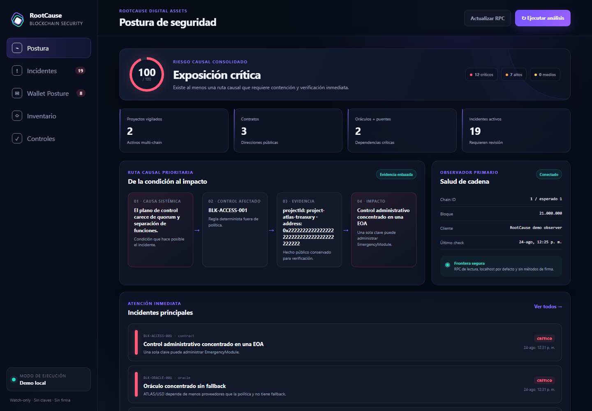
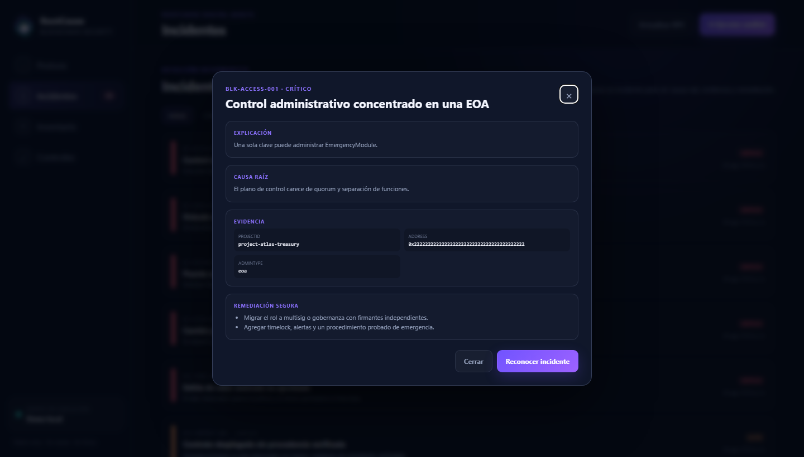
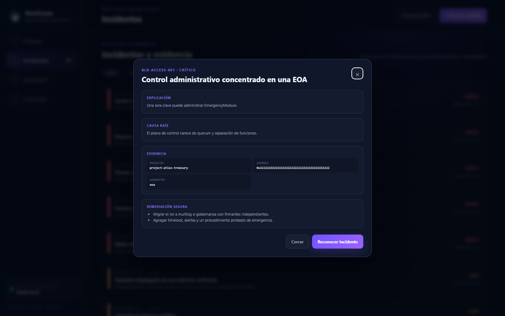
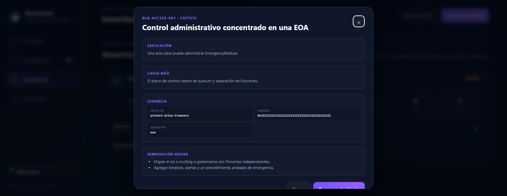
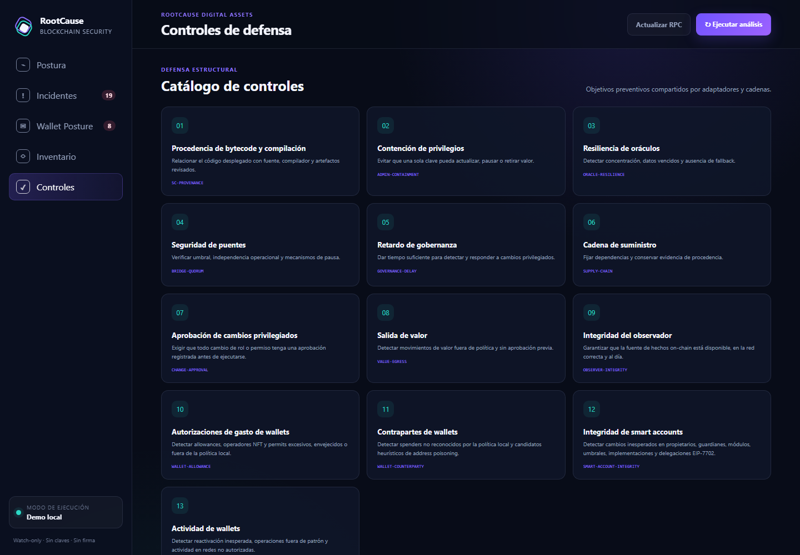

# Manual de usuario

Qué es cada cosa del panel, en claro. Si nunca has usado esta herramienta,
este es el documento por el que empezar.

## Qué hace, en una frase

Lleva el **inventario de controles** de tus aplicaciones blockchain y te avisa
cuando alguno está mal puesto, explicándote por qué y qué hacer.

No es una wallet, no es un antivirus y no es un explorador de bloques. **Nunca
te pedirá una clave privada**, y si se la das, la rechaza.

## Arrancar

Ejecuta **RootCause Blockchain Security**. Se abre una ventana de consola y, a
continuación, el panel en tu navegador (`http://127.0.0.1:8790`).

Para detener la aplicación, cierra la ventana de consola.

La primera vez arranca en **modo demostración**: datos ficticios, todo en
memoria, nada se escribe en disco. Sirve para recorrer el panel sin riesgo.

## Las cuatro pantallas

El panel tiene cuatro vistas en la barra izquierda. Cada una responde a una
pregunta distinta.

### 1. Postura · «¿cómo estoy ahora mismo?»

De arriba abajo:

| Elemento | Qué significa |
|---|---|
| **Riesgo causal consolidado** | Un número de 0 a 100 y una etiqueta. **No es una nota**: es la severidad del peor conjunto de incidentes abiertos. |
| **Críticos / altos / medios** | Cuántos incidentes activos hay de cada severidad. |
| **Proyectos, contratos, oráculos + puentes** | El tamaño de lo que estás vigilando. Si estos números no cuadran con la realidad, el inventario está incompleto y el resto del panel miente por omisión. |
| **Ruta causal prioritaria** | El incidente más grave contado en cuatro pasos: condición sistémica → control afectado → evidencia → impacto. Es el resumen que llevarías a una reunión. |
| **Observador primario** | Si la fuente de hechos on-chain está viva, en la cadena correcta y al día. |
| **Frontera segura** | Recordatorio de la postura: RPC de lectura, localhost por defecto, sin métodos de firma. |

**Botones de la cabecera:**

- **Actualizar RPC** — vuelve a preguntarle al nodo su estado. Úsalo si acabas
  de arreglar la conexión.
- **Ejecutar análisis** — vuelve a evaluar todo el inventario con las reglas.
  Es la acción que genera incidentes nuevos.

### 2. Incidentes · «¿qué está mal y qué hago?»

Cada fila es un hallazgo: su **código** (`BLK-…`), el tipo de entidad afectada,
el título, una explicación de una línea y la severidad.

Los filtros **Activos / Críticos / Todos** acotan la lista. «Activos» es la
vista por defecto: lo que sigue abierto o reconocido.

Haz clic en cualquier incidente para abrir el detalle:

| Sección | Para qué sirve |
|---|---|
| **Explicación** | Qué se detectó, en una frase. |
| **Causa raíz** | *Por qué es posible.* Esta es la parte que distingue el producto: no te dice solo que el admin es una EOA, te dice que el plano de control carece de quorum y separación de funciones. |
| **Evidencia** | Los datos públicos conservados: proyecto, dirección, valores observados y umbral de política. Es lo que pegarías en un informe. |
| **Remediación segura** | Los pasos concretos. **La aplicación no los ejecuta**: los ejecuta una persona con su runbook. |

El botón **Reconocer incidente** marca que ya lo has visto y estás trabajando
en él. No lo cierra ni lo oculta: cambia su estado a `acknowledged`.

### 3. Inventario · «¿qué estoy vigilando exactamente?»

Un panel por proyecto, con su cadena, su criticidad y el recuento de contratos,
oráculos, puentes y dependencias. Debajo, cada contrato con su dirección
pública y un punto de color según su estado.

**Aquí solo hay procedencia y controles verificables.** Sin secretos, sin
firmas, sin credenciales — por diseño, no por omisión.

> La **criticidad** que asignes a cada proyecto no es decorativa: determina la
> severidad de sus incidentes. Un proyecto marcado `critical` convierte en
> `critical` los hallazgos que en uno `low` serían `high`.

### 4. Controles · «¿qué me protege de qué?»

Los nueve objetivos preventivos y las reglas que verifican cada uno. Es el mapa
para entender por qué existe cada detección.

## Del modo demostración a tus datos

El modo demostración no guarda nada. Para trabajar con tu inventario real:

1. Ejecuta **Generar clave de datos**. Te dará una clave AES-256.
2. Guárdala en tu gestor de contraseñas. **Si la pierdes, los datos cifrados no
   se pueden recuperar.**
3. Crea `%LOCALAPPDATA%\RootCause\blockchain-security\config.cmd` con:

   ~~~bat
   set "DEMO_MODE=false"
   set "ROOTCAUSE_DATA_KEY=la-clave-que-generaste"
   ~~~

4. Vuelve a ejecutar la aplicación. Ahora el estado se cifra en disco con
   AES-256-GCM y la auditoría se encadena con SHA-256.

## Conectar un nodo (opcional)

Sin nodo, la herramienta evalúa el inventario que declaras. Con nodo, además
vigila la cadena.

Añade a `config.cmd`:

~~~bat
set "EVM_RPC_URL=http://127.0.0.1:8545"
set "EVM_EXPECTED_CHAIN_ID=1"
set "WATCHTOWER_ENABLED=true"
~~~

La aplicación **solo puede invocar métodos de lectura**. Cualquier método de
firma, envío o desbloqueo se rechaza antes de salir a la red.

Si tu nodo es remoto necesitas además `EVM_ALLOW_REMOTE_RPC=true`. Piénsalo dos
veces: **el proveedor al que consultes ve qué contratos estás vigilando.**

## Qué hacer ante un rojo

1. **No toques nada en cadena todavía.** Lee la causa raíz.
2. **Comprueba la evidencia con una segunda fuente.** Un RPC puede mentir o
   estar comprometido; un explorador independiente es una verificación barata.
3. **Abre el runbook** correspondiente en [`RUNBOOK.md`](RUNBOOK.md).
4. **Decide con una persona más.** Toda acción privilegiada exige aprobación
   humana separada — es el sexto principio del producto, no una formalidad.
5. **Reconoce el incidente** para dejar constancia de que está en curso.

## Qué NO hacer

- **No metas claves, mnemónicos ni credenciales** en ningún campo. La
  aplicación los rechaza, pero el hábito es peligroso en sí mismo.
- **No trates el número de riesgo como una nota.** Un 100 no significa que todo
  esté mal: significa que hay al menos una ruta causal que exige contención.
- **No asumas que un inventario limpio es un sistema seguro.** Esta herramienta
  no analiza el bytecode ni sustituye una auditoría.
- **No dejes el panel abierto como si fuera monitorización.** El watchtower solo
  vigila mientras la aplicación está en marcha.

## Si algo falla

Ver [`TROUBLESHOOTING.md`](TROUBLESHOOTING.md).
