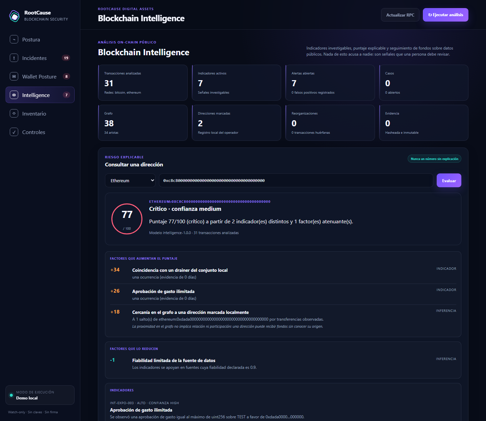

# 🎤 Presentación del producto

> 🧭 [Volver al README](../README.md) · [📘 Índice de documentación](INDEX.md) ·
> [📖 Manual de usuario](MANUAL_USUARIO.md) · [🧩 La familia RootCause](FAMILIA_ROOTCAUSE.md)

Este documento es la **fuente única** de la presentación de RootCause Blockchain
Security: de aquí salen, sin escribirse dos veces, los tres formatos que se
publican en cada despliegue.

| Formato | Para qué sirve | Dónde está |
| --- | --- | --- |
| 🖥️ **Diapositivas (HTML)** | Proyectar desde el navegador, sin instalar nada | [presentacion.html](https://vladimiracunadev-create.github.io/rootcause-blockchain-security/presentacion/presentacion.html) |
| 🎞️ **Diapositivas (PDF)** | Proyectar sin conexión y repartir como material | [PRESENTACION.pdf](https://vladimiracunadev-create.github.io/rootcause-blockchain-security/presentacion/PRESENTACION.pdf) |
| 🧾 **Pauta del expositor (PDF)** | Guion hablado, tiempos, demo y anexos | [PAUTA.pdf](https://vladimiracunadev-create.github.io/rootcause-blockchain-security/presentacion/PAUTA.pdf) |

**Ocho diapositivas, no más.** La muestra está pensada para exponerse de una
sentada: ocho láminas con letra grande y lo esencial en pantalla, y **todo el
detalle en la pauta**, que es el documento de apoyo que lee quien expone. Si
alguien quiere profundizar, el [índice de documentación](INDEX.md) está a un
enlace.

**Cómo se estructura este documento.** Tiene dos clases de secciones:

- **`## N · Título` es una diapositiva.** El encabezado es su título y el cuerpo
  es **lo que se ve proyectado** (letra grande, poco texto). La cita que la
  cierra (`> **Pauta · N min.**`) no aparece en pantalla: es el libreto, y va
  dividido en dos bloques obligatorios que **no son lo mismo y no se leen
  igual**:
  - **`### Guion`** — lo que se pronuncia, **palabra por palabra**. Cada párrafo
    es una intervención y se numera sola en la pauta impresa, para volver al
    sitio exacto después de levantar la vista.
  - **`### Indicaciones`** — las acotaciones de escena: qué abrir, dónde
    detenerse, qué recortar, qué no hacer. **Nada de esto se dice en voz alta.**

  Los minutos de cada diapositiva se suman automáticamente para calcular la
  duración total de la charla.
- **`## Anexo · Título` es material del expositor.** No se proyecta nunca: se
  imprime al final de la pauta. Ahí van la comprobación previa, los recortes
  según el tiempo que tengas, las preguntas que va a hacer la sala y las líneas
  que no se cruzan.

**Las cifras no se escriben a mano.** Cualquier `{{marcador}}` de este documento
lo rellena `scripts/build-presentation.js` contando los archivos del repositorio
—o **ejecutando el comando de verdad** y quedándose con su última línea, que es
lo que hace la lámina de la demo—. Una presentación de un producto de seguridad
con un número obsoleto proyectado a pantalla completa es la peor manera posible
de perder la sala.

**Para generarlo todo desde el repositorio:**

```bash
pnpm build:presentacion
```

---

## 1 · RootCause Blockchain Security

**Vigilar un sistema on-chain sin poder tocarlo: watch-only, local y sin claves.**

- Inventario multi-chain, postura de control e incidentes **con causa raíz**.
- {{controles}} controles · {{detecciones}} detecciones · {{indicadores}} indicadores de inteligencia.
- Aplicación de escritorio para Windows. **{{dependencias}} dependencias externas.**
- Nunca pide una semilla. Nunca firma. Nunca mueve fondos.

> **Pauta · 3 min.**
>
> ### Guion
>
> Buenas tardes, y gracias por el tiempo. Soy Vladimir Acuña, y les voy a mostrar
> una herramienta que vigila sistemas construidos sobre cadenas de bloques.
>
> La frase que la resume es esta: sirve para saber si un sistema on-chain está
> bien controlado, sin que la herramienta pueda tocarlo.
>
> Y esa segunda mitad de la frase es la parte importante, así que la digo despacio:
> esto no custodia claves, no firma transacciones y no mueve dinero. No puede. No
> es una política interna que alguien podría cambiar el mes que viene: es lo que
> el programa sabe hacer, y hay una prueba automatizada que lo verifica en cada
> cambio. Vamos a verla funcionando en unos minutos.
>
> Es una aplicación de escritorio. Se instala en un equipo, corre ahí, y no manda
> nada a ningún servidor mío ni de nadie.
>
> Lleva {{controles}} controles de defensa, {{detecciones}} detecciones y
> {{indicadores}} indicadores de análisis on-chain. Ahora vamos a ver qué
> significa cada una de esas tres cosas, porque no son lo mismo.
>
> Vamos a estar unos treinta minutos.
>
> **Si el grupo es pequeño:** Interrúmpanme cuando quieran, no hace falta esperar
> al final.
>
> **Si es un comité o una sala grande:** Les pido que guardemos las preguntas para
> el final, así llegamos con tiempo a todo.
>
> ### Indicaciones
>
> - Si vas a añadir una línea de credenciales tuyas, va después de la intervención
>   1 — una sola frase, y sigue. Nadie vino a oír tu currículum.
> - La intervención 3 es la que compra la credibilidad del resto de la charla.
>   Dila mirando a la sala, no a la pantalla, y haz una pausa de medio segundo
>   antes de "No puede".
> - Elige **una** de las dos versiones finales —la 7 o la 8— y cúmplela el resto
>   de la charla. Prometer preguntas al final y luego aceptarlas a mitad rompe el
>   tiempo.
> - No entres todavía en las reglas ni en la demo. Aquí solo se abre la puerta.

## 2 · El problema no son las claves

**Puedes tener la criptografía perfecta y perderlo todo igual.**

- Una EOA olvidada seguía siendo `owner` del proxy que actualiza el contrato.
- Un oráculo dejó de actualizarse y nadie miró el `heartbeat` hasta la liquidación.
- Un puente con quorum 2-de-3 tenía **los tres firmantes en la misma nube**.

> Ninguna de las tres es una falla criptográfica.
> Las tres son **fallas de control**, y todas eran visibles desde fuera.

> **Pauta · 4 min.**
>
> ### Guion
>
> Empecemos por el problema, porque casi siempre se cuenta mal.
>
> Cuando se habla de seguridad en blockchain, la conversación se va enseguida a
> las claves: dónde están las semillas, quién tiene el hardware, cuántas firmas
> hacen falta. Todo eso importa. Pero fíjense en estos tres casos.
>
> Primero. Un equipo despliega un contrato detrás de un proxy actualizable, hace
> las cosas bien, y meses después queda una cuenta externa —una sola dirección,
> con una sola clave— que todavía puede cambiar el código. Nadie la quitó. Nadie
> se acordaba de ella.
>
> Segundo. Un oráculo de precio deja de publicar. El contrato sigue leyendo el
> último valor porque nadie comprobó cuánto tiempo llevaba parado. La primera
> persona que se entera es la que recibe una liquidación que no correspondía.
>
> Tercero. Un puente exige dos firmas de tres. Perfecto sobre el papel. Los tres
> firmantes están en la misma región del mismo proveedor de nube. El quorum es
> real; la independencia, no.
>
> Ninguno de esos tres es un fallo de criptografía. Los tres son fallos de
> control. Y esto es lo que quiero que se lleven de esta lámina: los tres eran
> visibles desde fuera, sin claves, sin acceso privilegiado, solo mirando lo que
> la cadena publica.
>
> Si eran visibles y aun así nadie los vio, el problema no era la información.
> Era que nadie estaba mirando de forma sistemática. Eso es lo que hace esta
> herramienta.
>
> ### Indicaciones
>
> - Estos tres casos son **patrones de una clase de fallo**, no incidentes con
>   nombre y apellido. No los atribuyas a ninguna empresa ni protocolo concreto,
>   aunque alguien de la sala te ofrezca el nombre.
> - Si en la sala hay gente técnica, el segundo caso es el que más asiente.
>   Detente medio segundo ahí.
> - Si alguien pregunta "¿y esto detecta un reentrancy?", **no lo respondas
>   todavía**: es la pregunta 2 del anexo de preguntas y se contesta mucho mejor
>   después de la lámina 8.
> - No pongas cifras de pérdidas. En cuanto sale un número de titular, la
>   conversación se va al titular.

## 3 · Qué es: una consola local, watch-only

**Inventario, postura y evidencia. Todo en la máquina del operador.**


| Lo que trae dentro | Cuánto |
| --- | --- |
| Controles de defensa, del bytecode a la actividad de wallets | **{{controles}}** |
| Detecciones deterministas `BLK-*` | **{{detecciones}}** |
| Indicadores investigativos `INT-*` | **{{indicadores}}** |
| Escenarios sintéticos con su resultado esperado | **{{escenarios}}** |
| Pruebas automatizadas que CI ejecuta en cada cambio | **{{pruebas}}** |
| Dependencias externas | **{{dependencias}}** |

> **Pauta · 5 min.**
>
> ### Guion
>
> Esto es lo que ven al abrirla. Un panel, en el navegador, servido por un proceso
> que corre en el propio equipo, en la dirección ciento veintisiete punto cero
> punto cero punto uno. No hay una nube detrás. No hay una cuenta que crear.
>
> Arriba a la izquierda está el riesgo consolidado. Y aquí va la primera decisión
> de diseño que quiero que noten: ese número **nunca aparece solo**. A su derecha
> está la ruta causal completa, de la condición sistémica al impacto, con la
> evidencia pública que la sostiene. Un semáforo que no explica por qué está en
> rojo no sirve para decidir; sirve para poner nervioso a alguien.
>
> Debajo está el inventario: los proyectos, sus contratos, sus oráculos, sus
> puentes y sus dependencias, cada uno con su cadena y su criticidad. Solo
> procedencia y controles verificables. Direcciones públicas y nada más: aquí no
> hay secretos, ni firmas, ni credenciales.
>
> Y a la derecha, el estado del observador: si la herramienta está viendo la
> cadena de verdad, si está mirando la cadena correcta y si va atrasada. Un
> panel de seguridad que no sabe si sus propios datos están frescos miente con
> mucha seguridad.
>
> Los números de la tabla son los de esta versión, y no los escribí a mano: los
> cuenta el propio repositorio al generar estas diapositivas. Si mañana añadimos
> una detección, esta lámina cambia sola.
>
> Y el último de esa tabla es el que más discusiones ahorra: cero dependencias
> externas. Ni una sola librería de terceros. Ya volveremos a eso.
>
> ### Indicaciones
>
> - **Ten el panel abierto en otra pestaña antes de empezar la charla.** Si la
>   sala está receptiva, cambia a la aplicación real en la intervención 2 en vez
>   de señalar la captura. Si no arranca a la primera, sigue con la captura y no
>   lo comentes.
> - Señala físicamente el número de riesgo y luego la ruta causal, en ese orden.
>   El gesto hace el argumento.
> - Si preguntan por el precio o la licencia, contesta en tres palabras —"MIT,
>   código abierto"— y sigue. La lámina 8 lo desarrolla.
> - No leas la tabla entera en voz alta. Di solo la primera fila y la última.

## 4 · De la alerta suelta a la causa raíz

**Un incidente que no dice qué arreglar es ruido con formato.**


- Cada hallazgo abre con **explicación, causa raíz, evidencia y remediación**.
- Las reglas son **deterministas**: el mismo estado produce el mismo veredicto.
- Cada código `BLK-*` pertenece a un control del catálogo. Un gate lo obliga.
- La remediación es un **runbook para una persona**, no un botón.

> **Pauta · 5 min.**
>
> ### Guion
>
> Esta es la diferencia entre esta herramienta y un panel de alertas, y es toda la
> tesis del producto.
>
> Lo que ven es un incidente abierto. Arriba, el código: be-ele-ka, guion, access,
> guion, cero cero uno. Debajo, cuatro bloques que siempre están, en este orden.
>
> El primero es la explicación: qué pasa, en una frase, en castellano.
>
> El segundo es la causa raíz. No el síntoma: la condición que lo produce. En este
> caso, que el control administrativo de un contrato crítico está concentrado en
> una cuenta externa, que es una sola clave.
>
> El tercero es la evidencia: el proyecto y la dirección concretos, conservados,
> para que mañana se pueda revisar por qué se dijo esto.
>
> Y el cuarto es la remediación, que son pasos para una persona. Fíjense en que
> no hay un botón que diga "arreglar". Es deliberado, y lo vamos a ver en la
> lámina de los principios.
>
> Dos detalles que en un comité importan más de lo que parece.
>
> Uno: las reglas son deterministas. El mismo estado produce siempre el mismo
> veredicto. No hay un modelo decidiendo hoy una cosa y mañana otra sobre los
> mismos datos.
>
> Y dos: cada uno de esos códigos tiene que existir en el catálogo de controles y
> en la documentación. Hay una comprobación automática que lo exige y que rompe la
> compilación si alguien añade una regla y se olvida de documentarla. Es un
> detalle pequeño, pero es el que evita el peor momento posible: durante un
> incidente real, alguien busca qué significa un código y no lo encuentra en
> ninguna parte.
>
> ### Indicaciones
>
> - Lee los cuatro bloques **en orden y señalándolos**. Es la lámina en la que más
>   sirve el dedo en la pantalla.
> - "Reentrancy", "auditoría" y "fuzzing" suelen aparecer aquí. Si sale, remite a
>   la lámina 8 con una frase: "eso lo respondo en la penúltima, y la respuesta es
>   que no".
> - Si la sala es de negocio y no técnica, sáltate la intervención 8 entera
>   (determinismo) y ve directo al catálogo.
> - No entres en la sintaxis del catálogo ni abras el JSON. No es el sitio.

## 5 · Wallets e inteligencia: señalar no es acusar

**Dos catálogos separados a propósito, y no se mezclan nunca.**



| | Postura `BLK-*` | Inteligencia `INT-*` |
| --- | --- | --- |
| Qué afirma | Un control **está mal puesto** | Hay algo **que conviene revisar** |
| Cómo se decide | Regla determinista contra política | Indicador con umbral calibrable |
| Qué produce | Un incidente con remediación | Una señal con su explicación |
| Lo que **nunca** hace | — | Atribuir identidad, inferir intención, bloquear fondos |

> **Pauta · 4 min.**
>
> ### Guion
>
> Aquí hay dos mitades del producto, y la peor cosa que puedo hacer es dejar que
> se confundan.
>
> La mitad de la izquierda es la postura: {{detecciones}} detecciones que afirman
> algo. Cuando sale una, la herramienta está diciendo "este control está mal
> puesto según la política que ustedes mismos declararon".
>
> La mitad de la derecha es la inteligencia: {{indicadores}} indicadores sobre
> datos públicos de Bitcoin y Ethereum. Fan-in, fan-out, cadenas de peeling,
> transferencias rápidas, envenenamiento de direcciones, aprobaciones ilimitadas.
> Y aquí la herramienta **no afirma nada**. Señala algo que conviene mirar.
>
> Esa distinción parece de matiz y no lo es. Un indicador que se trata como una
> acusación se convierte en una lista negra casera, y una lista negra casera
> arruina a gente inocente. Así que el producto lo separa en el código, no en el
> manual: cada resultado distingue el hecho observado, el indicador, la inferencia
> y la hipótesis, y ninguna de esas categorías asciende sola a la siguiente.
>
> Vean el buscador de riesgo. Devuelve un puntaje de cero a cien, sí. Pero devuelve
> también la banda, la confianza, cada factor que lo compone con su peso, la
> evidencia, las limitaciones y la versión del modelo. Nunca un número suelto. Hay
> una prueba automatizada que comprueba exactamente eso, porque un puntaje sin
> explicación es lo que convierte una herramienta de análisis en una máquina de
> acusar.
>
> Y por si queda duda: esto no consulta listas remotas de reputación, no pone
> nombre a una dirección, y no puede bloquear ni un céntimo.
>
> ### Indicaciones
>
> - Esta es la lámina delicada si en la sala hay alguien de cumplimiento o de
>   prevención de lavado. La frase que necesitan oír es la intervención 6
>   completa. No la resumas.
> - Si preguntan si sustituye a un proveedor de análisis de cadena, la respuesta
>   está en el anexo de preguntas. Es que no, y por qué.
> - La captura muestra el grafo con sus cotas. Si alguien pregunta por el tamaño,
>   di que los límites son duros y están en la documentación, y sigue.
> - No prometas soporte de más cadenas que Bitcoin y Ethereum en esta lámina. La
>   lámina 8 fija esa frontera.

## 6 · Seis principios que se comprueban solos

**Una promesa de seguridad que nadie verifica es material de marketing.**

1. Nunca pide ni guarda semillas, claves, keystores ni transacciones sin publicar.
2. No firma, no construye y no transmite transacciones.
3. El JSON-RPC usa una **allowlist estricta de métodos de lectura**.
4. Acepta `localhost`; un destino remoto exige habilitación explícita.
5. Las reglas son deterministas. **La IA es opcional y no tiene autoridad.**
6. Toda acción privilegiada exige runbook y aprobación humana separada.

> Los seis se verifican **arrancando la aplicación real** y atacándola:
> **{{invariantes}} invariantes** en `scripts/check-security-claims.js`.

> **Pauta · 4 min.**
>
> ### Guion
>
> Estos son los seis principios que el producto no negocia. Los voy a leer rápido,
> porque lo interesante no son los principios: es la línea de abajo.
>
> No pide ni guarda material secreto. No firma ni transmite transacciones. El
> canal hacia la cadena solo puede hacer llamadas de lectura, de una lista cerrada.
> Habla con un nodo local salvo que alguien active explícitamente uno remoto. Las
> reglas son deterministas y la parte de inteligencia artificial es opcional y no
> decide nada. Y cualquier acción privilegiada necesita un procedimiento escrito y
> una persona que apruebe, aparte.
>
> Ahora, la línea de abajo.
>
> Cualquiera puede escribir estos seis puntos en una web. Lo que quiero enseñarles
> es cómo se comprueban aquí. Hay un script que arranca la aplicación de verdad
> —no una simulación, el servidor real— y la ataca. Le manda claves privadas.
> Le manda frases semilla. Le manda keystores, tokens de proveedor, transacciones
> firmadas, peticiones sin la cabecera correcta y peticiones desde otro origen. Y
> comprueba que las rechaza todas.
>
> Son {{invariantes}} comprobaciones, y corren en cada cambio, en la integración
> continua. Si alguien —yo incluido— añade mañana una función que acepte una clave
> privada, no compila.
>
> Eso es lo que separa un principio de una promesa. Y lo van a ver ejecutarse
> ahora mismo.
>
> ### Indicaciones
>
> - Lee los seis puntos **rápido y sin detenerte**. El peso está en la línea final,
>   no en la lista.
> - Si hay un CISO en la sala, este es el momento en que empieza a tomar notas.
>   Dale dos segundos de silencio después de "no compila".
> - Ten preparada la respuesta a "¿y quién audita el script?": la contesta el
>   anexo de preguntas, y la respuesta honesta empieza por "nadie externo,
>   todavía".
> - No entres en el detalle de las cabeceras ni del CSRF. Es la lámina siguiente
>   la que enseña, no esta.

## 7 · Demo en vivo: 90 segundos de terminal

**Dos comandos. Sin red, sin instalar nada, sin datos reales.**

| Comando | Lo que imprime |
| --- | --- |
| `pnpm check:local-only` | {{demo-local-only}} |
| `pnpm check:security` | {{demo-security}} |

> Esta tabla se rellena **ejecutando los dos comandos** al generar las
> diapositivas. Si la terminal falla delante del público, señálala y sigue.

> **Pauta · 4 min.**
>
> ### Guion
>
> Noventa segundos de terminal. Dos comandos, y los dos corren sin red.
>
> **Demo A · cero dependencias**
>
> El primero comprueba el claim de distribución. Lo ejecuto.
>
> Lo que acaba de verificar es que este repositorio no declara ni una dependencia
> externa, que no hay un árbol instalado, que ningún archivo importa nada que no
> sea la biblioteca estándar de Node o un archivo de este mismo repositorio, que
> el panel no carga nada de ningún servidor externo, y que no hay ni un proveedor
> de RPC alojado escrito en el código.
>
> Por qué me importa tanto: cada librería que entra trae su propio árbol, y ese
> árbol es por donde han entrado los últimos ataques serios a la cadena de
> suministro de software. Una herramienta que vigila sistemas de valor no puede
> tener quinientos paquetes de terceros ejecutándose dentro.
>
> **Demo B · los invariantes**
>
> El segundo es el de la lámina anterior. Lo ejecuto y esperen a la última línea.
>
> Ahí está: {{invariantes}} comprobaciones. Cada una arrancó la aplicación real y
> le mandó algo hostil. Si me creen una sola cosa de toda la charla, que sea esta:
> los principios de la lámina anterior son ejecutables, y acaban de ejecutarse.
>
> ### Indicaciones
>
> - **Ejecuta los dos comandos una vez antes de que entre el público.** La primera
>   ejecución siempre tarda más y ese silencio se hace largo.
> - Terminal con letra grande —dieciocho puntos como mínimo— y fondo oscuro.
>   Limpia la pantalla entre los dos comandos.
> - **Si la terminal falla: no la arregles delante de la sala.** Señala la tabla de
>   la lámina, di "esta es la salida" y sigue. Es exactamente para eso que está
>   impresa ahí.
> - No abras el editor. No enseñes el código de los scripts. Aquí se enseña la
>   salida, no la implementación.
> - Si vas corto de tiempo, sacrifica la Demo A y quédate con la B.

## 8 · Lo que nunca hará, y cómo se adopta

**La lista de lo que no hace es parte del producto, no una nota al pie.**

| Nunca | Sí, hoy |
| --- | --- |
| Custodiar claves ni firmar | Vigilar controles y explicar por qué fallan |
| Sustituir una auditoría o una verificación formal | Detectar controles mal puestos, en continuo |
| Atribuir identidad ni bloquear fondos | Señalar lo que conviene investigar, con evidencia |
| Prometer soporte de toda cadena | EVM implementado; el resto, por eventos normalizados |

- **Empezar:** descargar el instalador de Windows, o `pnpm start` para el modo demo.
- **Antes de datos reales:** la lista de comprobación de seguridad. En ese orden.
- **Licencia MIT.** Versión {{version}}. Sin telemetría, sin cuenta, sin nube.

> **Pauta · 3 min.**
>
> ### Guion
>
> Y termino por donde suelen terminar mal estas presentaciones: por lo que la
> herramienta no hace.
>
> No custodia claves y no firma. Eso ya lo dije tres veces y es a propósito.
>
> No sustituye una auditoría de contratos, ni verificación formal, ni fuzzing, ni
> respuesta profesional a incidentes. Un inventario limpio no demuestra que un
> contrato no tenga una vulnerabilidad. Demuestra que los controles que ustedes
> declararon están donde dijeron que estaban.
>
> No atribuye identidad a una dirección y no puede bloquear fondos.
>
> Y no les voy a prometer que soporta todas las cadenas. Lo implementado hoy es
> EVM. Otras redes pueden entrar mandando hechos ya normalizados a un endpoint,
> pero mientras no existan adaptadores y pruebas reales, no se declaran
> soportadas. Prefiero decirlo aquí que descubrirlo ustedes en un piloto.
>
> ¿Cómo se empieza? Se descarga el instalador de Windows y se abre. Arranca en
> modo demostración, con datos ficticios y en memoria: no escribe nada en disco.
> Se puede recorrer entero sin conectar nada real.
>
> Cuando quieran datos de verdad, hay una lista de comprobación de seguridad que
> hay que hacer antes, en ese orden. Está en la documentación y no es larga.
>
> Es software libre, licencia MIT. No hay telemetría, no hay cuenta que crear y no
> hay nube. Si les sirve, se lo llevan.
>
> Muchas gracias.
>
> ### Indicaciones
>
> - Esta lámina se lee entera y sin prisa. Es la que decide si un comité te vuelve
>   a llamar.
> - Después de "Muchas gracias", **cállate**. El primer silencio lo rompe la sala,
>   no tú.
> - Ten a mano el anexo de preguntas: la mitad de lo que van a preguntar está ahí
>   con la respuesta ya redactada.
> - Si alguien pide una versión para Linux o macOS, la respuesta honesta está en el
>   anexo. No improvises una fecha.

---

## Anexo · La comprobación de los diez minutos previos

Antes de que entre nadie, en este orden:

1. **Descarga los dos PDF.** Proyecta `PRESENTACION.pdf` a pantalla completa y
   deja `PAUTA.pdf` impreso o en un segundo monitor. Si solo tienes una pantalla,
   imprímela: leer la pauta en el móvil se nota desde la primera fila.
2. **Abre una terminal en el repositorio con letra de 18 puntos o más**, fondo
   oscuro, y ejecuta **una vez** `pnpm check:local-only` y `pnpm check:security`.
   La primera ejecución siempre tarda más, y ese silencio se hace largo.
3. **Arranca el panel** con `pnpm start` y déjalo abierto en
   `http://127.0.0.1:8790`, en una pestaña aparte. En modo demo no escribe nada
   en disco.
4. **Comprueba que el panel trae inventario.** Si arranca vacío, no lo enseñes:
   usa las capturas de las láminas 3, 4 y 5, que son del producto real.
5. **Desactiva las notificaciones del sistema.** Una ventana emergente en una
   charla sobre seguridad es la única cosa que la sala va a recordar.
6. **Decide ahora si aceptas preguntas a mitad o al final**, y dilo en la lámina 1.

Si algo de esto falla y no da tiempo a arreglarlo: la charla funciona entera con
las diapositivas. La demo es la lámina 7 y su salida está impresa.

## Anexo · Si tienes más o menos tiempo

La charla completa dura unos **{{duracion}} minutos** sobre **{{laminas}} láminas**.

| Tienes | Qué proyectas | Qué sacrificas |
| --- | --- | --- |
| **10 min** | 1, 2, 6 y 8 | Todo el recorrido de producto y la demo. Quedan el problema, la promesa verificable y la frontera. |
| **20 min** | 1, 2, 3, 6, 7 y 8 | Las láminas 4 y 5. Menciona la causa raíz en una frase dentro de la 3. |
| **{{duracion}} min** | Todas | Nada. Es el guion completo. |
| **50 min** | Todas, y abres el panel de verdad | Nada. Añade recorrido en vivo por inventario e incidentes en las láminas 3 y 4, y deja 15 minutos de preguntas. |

Dos recortes que **no** debes hacer nunca, aunque vayas fatal de tiempo:

- **La lámina 8.** Una presentación de seguridad sin su lista de límites es
  publicidad, y una sala técnica lo detecta.
- **La segunda mitad de la lámina 5** —lo que la inteligencia nunca hace—. Sin
  esa frase, la parte de análisis on-chain suena a lista negra.

## Anexo · Las preguntas que te van a hacer

**"¿Esto reemplaza una auditoría de contratos?"**
No, y no se le parece. Una auditoría revisa el código en busca de
vulnerabilidades. Esto vigila si los controles alrededor del código están donde
deberían: quién puede actualizar, cuánto tarda un cambio en aplicarse, si el
oráculo sigue vivo, si el quorum del puente es real. Son problemas distintos y
los dos hacen falta.

**"¿Detecta un reentrancy o un fallo de lógica en el contrato?"**
No. No hace análisis estático del bytecode, ni simulación, ni fuzzing. Si esa es
la necesidad, lo que hace falta es una auditoría y herramientas de análisis de
contratos, y te lo digo aunque no me convenga.

**"¿Puede revocar un allowance peligroso cuando lo detecta?"**
No puede, y es deliberado. Detectarlo requiere leer; revocarlo requiere firmar.
En el momento en que esta herramienta pudiera firmar, se convertiría en un
objetivo mucho más valioso que el problema que resuelve. Lo que hace es abrir un
incidente con el procedimiento para que lo haga una persona con la wallet que
corresponde.

**"¿Por qué de escritorio y no un SaaS?"**
Porque el inventario de contratos, direcciones y controles de una organización es
información sensible en sí misma: dice exactamente qué vigilas y qué no. Subirla
a un servicio de terceros crea un problema nuevo para resolver el viejo. La
decisión está escrita y razonada en el ADR-0001 del repositorio.

**"¿Por qué cero dependencias? Suena a purismo."**
Es lo contrario del purismo, es aritmética de superficie de ataque. Cada
dependencia trae su propio árbol, y por ahí han entrado los ataques recientes a
la cadena de suministro de software. Una herramienta que vigila sistemas de valor
no puede tener cientos de paquetes de terceros corriendo dentro. El coste es que
hay que escribir más código a mano; me parece un buen cambio.

**"¿Sustituye a un proveedor de análisis de cadena?"**
No. Un proveedor comercial tiene atribución, listas y cobertura que esto no tiene
y que no pretende tener. Esto analiza **lo que se le ingirió**, no consulta
reputación externa y no pone nombre a una dirección. Son herramientas distintas y
pueden convivir.

**"¿Y quién verifica que el verificador dice la verdad?"**
Hoy, nadie externo. El código de las comprobaciones es abierto y se puede leer
entero; los invariantes están en un solo archivo y son legibles. Una auditoría
independiente sería el siguiente paso lógico y todavía no existe. Prefiero
decirlo así que insinuar lo contrario.

**"¿Hay versión para Linux o macOS?"**
Hoy el empaquetado es de Windows. El programa es Node y corre en los tres
sistemas desde el repositorio, pero un instalador que no he construido ni probado
no lo voy a anunciar como disponible.

**"¿Qué pasa si el nodo RPC al que consulta miente?"**
Es una limitación real y está escrita en la documentación. Un RPC puede estar
comprometido o desactualizado. Por eso el producto vigila su propio observador
—si está caído, si está en la cadena equivocada, si va atrasado— y por eso la
recomendación para eventos críticos es una segunda fuente independiente.

**"¿Cuánto cuesta?"**
Nada. Licencia MIT, código abierto. Lo que cuesta es el tiempo de configurarlo
bien y de adaptar los umbrales al riesgo de cada sistema, que no es cero.

## Anexo · Lo que no hay que prometer

Estas frases no se dicen, aunque la sala esté yendo bien y aunque alguien las
ponga en tu boca:

- **"Detecta exploits."** No. Detecta controles mal puestos y señales que conviene
  investigar. Un exploit puede ocurrir con todos los controles en verde.
- **"Si lo tuvieran instalado, no les habría pasado."** No lo puedes saber, y en
  cuanto lo dices dejas de ser creíble.
- **"Soporta Solana / Cosmos / la cadena que te nombren."** Lo implementado es EVM.
  Otras redes pueden enviar hechos ya normalizados al endpoint de observación,
  pero sin adaptadores y pruebas reales **no se declaran soportadas**.
- **"El puntaje de riesgo demuestra que esa dirección es maliciosa."** El puntaje
  mide exposición a señales investigables sobre los datos ingeridos. No es una
  prueba, no atribuye identidad, y la ausencia de indicadores no demuestra
  ausencia de riesgo.
- **"Los binarios están firmados."** No lo están: no hay certificado de firma de
  código. Windows SmartScreen puede advertir en la primera ejecución. Lo que hay
  es el hash SHA-256 publicado en cada release, y eso es lo que se dice.
- **"Vigila las veinticuatro horas."** El observador vigila mientras el panel está
  abierto. Para vigilancia continua el camino soportado es el despliegue
  self-hosted.
- **"Los umbrales que trae son los correctos para ustedes."** Son ejemplos.
  Mal ajustados producen falsos positivos, no seguridad.
- **Cualquier fecha de entrega.** Si preguntan cuándo estará algo del roadmap, la
  respuesta es que está en el roadmap del repositorio y que no comprometo fechas.
