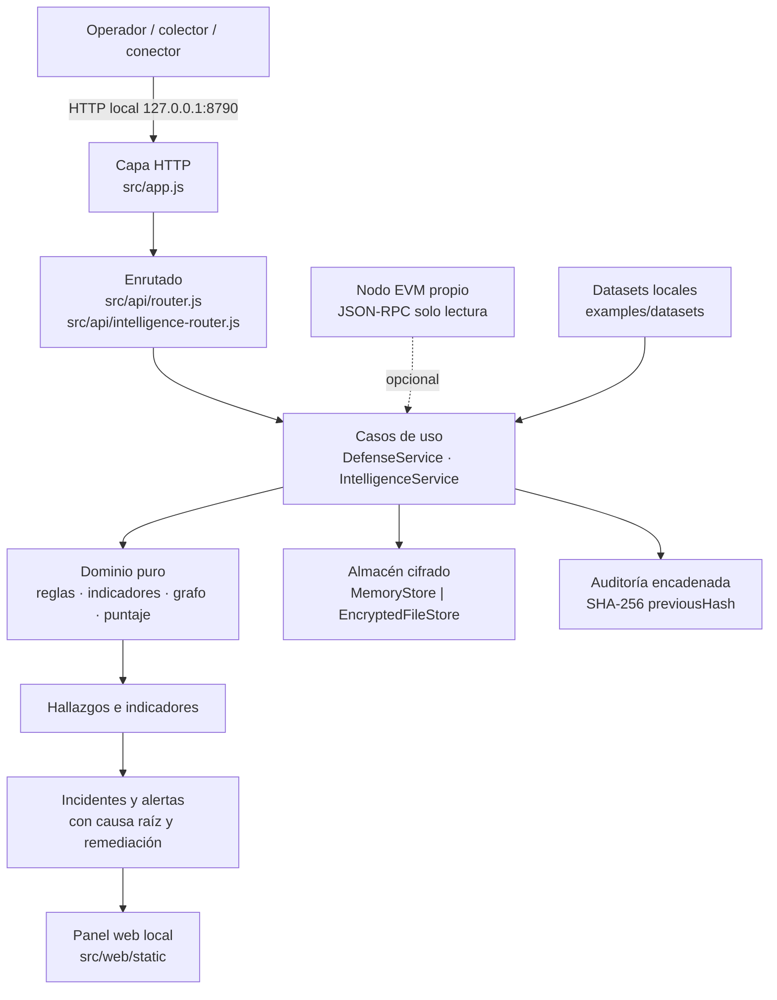

# 01 · Descripción general del sistema

> Versión analizada: `0.3.0` · Commit `6d96e71` · Fecha: 2026-08-27
> [← Volver al índice](README.md)

## El sistema explicado para una persona no técnica

Imagina una empresa que gestiona dinero en una cadena de bloques —una red
pública donde cada movimiento queda registrado a la vista de todos—. Esa empresa
puede tener las contraseñas perfectamente guardadas y perderlo todo igual:
porque una cuenta antigua que nadie recordaba seguía teniendo permiso para
cambiar el programa que custodia los fondos, porque el servicio que informa del
precio dejó de actualizarse y nadie lo notó, o porque un permiso de gasto que se
concedió una vez para comprar algo nunca se retiró y sigue vivo dos años después.

**RootCause Blockchain Security es un vigilante que mira todo eso y avisa.**

Tres precisiones importantes sobre qué clase de vigilante es:

1. **Solo mira.** No guarda contraseñas, no firma nada, no mueve dinero. Es
   deliberado: si el programa no tiene la capacidad de mover fondos, entonces
   robar el programa no sirve para mover fondos.
2. **Funciona en tu propio ordenador.** No hay servidor, no hay nube, no hay
   cuenta que crear. Los datos no salen de la máquina, y por lo tanto nadie
   externo se entera de qué estás vigilando ni de qué estás investigando.
3. **Explica en lugar de sentenciar.** Cuando encuentra algo, no dice «alerta
   roja» y calla: dice qué observó, por qué eso es un problema, qué política
   incumple, qué evidencia lo respalda, cómo podría ser una falsa alarma y qué
   pasos dar. La decisión siempre es de una persona.

Hay un segundo uso, complementario: **investigar el rastro del dinero**. Si un
proyecto sufre un robo, el sistema permite cargar las transacciones públicas
implicadas, dibujar el mapa de por dónde se movió el valor, marcar señales
sospechosas reproducibles y armar un expediente con evidencia sellada. Y aquí la
misma cautela: el sistema **nunca dice quién es alguien**. Una dirección de
blockchain no es una persona, y el producto se niega estructuralmente a hacer esa
traducción.

---

## Qué problema resuelve

**Hecho verificado** — el `README.md` del repositorio lo enuncia así: «En una
cadena programable puedes tener las claves perfectas y perderlo todo igual».

El problema concreto que ataca es que las pérdidas de este ecosistema rara vez
vienen de romper la criptografía. Vienen de **fallos de control**: privilegios
mal contenidos, dependencias económicas frágiles, cambios sin aprobación,
autorizaciones de gasto que sobreviven a su propósito, y observadores que
dejaron de ver sin que nadie se diera cuenta.

Ese tipo de fallo tiene tres características que lo hacen apto para una
herramienta determinista:

| Característica | Consecuencia para el diseño |
|---|---|
| Es **estructural**, no aleatorio | Se puede describir con reglas, no con modelos probabilísticos |
| Es **observable en público** | No hace falta ningún dato privado ni ninguna clave |
| Se detecta **antes** del impacto | Existe una ventana de detección y respuesta |

---

## A quién está dirigido

**Inferencia basada en el código y en la documentación existente**
([`../RECLUTADORES.md`](../RECLUTADORES.md), [`../MANUAL_USUARIO.md`](../MANUAL_USUARIO.md)):

| Actor | Qué hace con el sistema | Evidencia en el código |
|---|---|---|
| **Operador / equipo de seguridad** | Registra el inventario, ejecuta análisis, revisa incidentes, los reconoce o los resuelve | `POST /api/projects`, `POST /api/scan`, `PATCH /api/incidents/{id}` |
| **Analista de investigación** | Ingiere transacciones, revisa alertas, abre casos, adjunta evidencia, genera informes | `IntelligenceService.openCase`, `attachEvidence`, `caseReport` |
| **Colector automático** | Envía hechos on-chain normalizados a la aplicación | `POST /api/observe/event`, cabecera `x-rootcause-actor` |
| **Watchtower (proceso interno)** | Refresca el observador y relanza el análisis en intervalos | `src/services/watchtower.js` |
| **Auditor** | Verifica la cadena de auditoría, la integridad de la evidencia y los invariantes | `GET /api/audit`, `GET /api/v1/intelligence/evidence/verify` |

No hay usuarios, contraseñas ni roles dentro de la aplicación: **el control de
acceso es el control de acceso del propio equipo**. Ver
[11 · Seguridad](11-security.md) para el detalle de esa decisión y sus
consecuencias.

---

## Casos de uso principales

1. **Inventariar** una aplicación blockchain: contratos, oráculos, puentes,
   gobernanza y dependencias, con su criticidad y su entorno.
2. **Detectar fallas de control** de forma determinista y reproducible: 22
   reglas `BLK-*` agrupadas en 13 controles.
3. **Vigilar cuentas públicas** (*Wallet Security Posture*): autorizaciones de
   gasto, operadores NFT, permits usados, cambios de smart account,
   delegaciones EIP-7702 y actividad fuera de patrón.
4. **Correlacionar eventos on-chain** con las aprobaciones registradas, para
   distinguir un cambio autorizado de uno que no lo está.
5. **Vigilar el propio observador**: si el nodo RPC cae, apunta a la red
   equivocada o se queda atrás, eso también es un incidente.
6. **Investigar el movimiento de fondos**: ingesta idempotente, 15 indicadores
   `INT-*`, grafo acotado, puntaje explicable, alertas, casos y evidencia
   sellada.
7. **Consultar riesgo desde otro producto** a través de una API versionada
   `/api/v1`, siempre consultiva.

---

## Funcionalidades principales

**Hecho verificado** — todas se pueden ejercitar desde el panel o desde la API.

| Funcionalidad | Punto de entrada | Módulo responsable |
|---|---|---|
| Registro de proyecto | `POST /api/projects` | `DefenseService.addProject` |
| Registro de cuenta vigilada | `POST /api/accounts` | `DefenseService.addWatchedAccount` |
| Observación de un evento | `POST /api/observe/event` | `DefenseService.observeEvent` |
| Aprobación de un hash de cambio | `POST /api/approvals` | `DefenseService.approvePolicyHash` |
| Análisis de riesgo (reglas) | `POST /api/scan` | `evaluateState` en `src/domain/rule-engine.js` |
| Refresco del observador RPC | `POST /api/node/refresh` | `EvmRpcClient.snapshot` |
| Ciclo de vida del incidente | `PATCH /api/incidents/{id}` | `DefenseService.updateIncident` |
| Auditoría encadenada | `GET /api/audit` | `verifyAuditChain` |
| Ingesta de transacciones | `POST /api/v1/intelligence/ingest` | `IntelligenceService.ingest` |
| Motor de indicadores | `POST /api/v1/intelligence/analyze` | `evaluateIndicators` |
| Puntaje explicable | `GET /api/v1/risk/addresses/{red}/{dir}` | `assessRisk` |
| Análisis previo consultivo | `POST /api/v1/risk/transactions` | `assessTransactionIntent` |
| Grafo, caminos, ciclos, comunidades | `GET /api/v1/intelligence/graph\|paths\|cycles\|communities` | `src/domain/intelligence/graph.js` |
| Casos, evidencia e informe | `/api/v1/intelligence/cases...` | `IntelligenceService` |

---

## Flujo general de funcionamiento

**Explicación del diagrama.** Todo entra por una única capa HTTP que escucha en
loopback. Esa capa aplica cabeceras de seguridad, limita el ritmo de peticiones y
exige una cabecera propia para cualquier mutación. Luego el enrutado decide entre
la API heredada (`/api/...`, defensa e inventario) y la API versionada
(`/api/v1/...`, inteligencia). Ambas llaman a servicios de caso de uso, que son
los únicos que tocan el almacén y la auditoría; el dominio es puro y no conoce ni
HTTP ni disco. El resultado —hallazgos e indicadores— se convierte en incidentes
y alertas con causa raíz, y el panel los muestra. Las dos fuentes externas
posibles son un nodo EVM propio, opcional y de solo lectura, y los datasets
locales, que es la fuente por defecto.

---

## Entradas y salidas

### Entradas

| Entrada | Origen | Validación |
|---|---|---|
| Proyecto (inventario) | Operador vía API o panel | `normalizeProject` en `src/services/defense-service.js` |
| Cuenta pública vigilada | Operador | `normalizeWatchedAccount` (rechaza datos personales) |
| Evento on-chain de proyecto | Colector | `enumValue` sobre `EVENT_TYPES` |
| Evento wallet normalizado | Colector | `normalizeWalletEvent` (exige `transactionHash`) |
| Aprobación de cambio | Operador | `optionalApprovalHash` (SHA-256) |
| Transacciones y bloques | Dataset, conector o API | `normalizeTransaction`, `normalizeBlock` |
| Registro local de contratos/drainers/puentes | Analista | `normalizeContractRecord` |
| Instantánea del nodo | RPC EVM propio | `EvmRpcClient.snapshot` con allowlist |

### Salidas

| Salida | Consumidor | Formato |
|---|---|---|
| Resumen de postura | Panel, integraciones | JSON (`/api/summary`) |
| Incidentes con causa raíz y remediación | Panel, operador | JSON |
| Cadena de auditoría verificable | Auditor | JSON con verificación de hashes |
| Indicadores y alertas | Panel, analista | JSON |
| Evaluación de riesgo explicable | Wallet, servicio externo, panel | JSON con factores y limitaciones |
| Informe de caso | Analista, auditoría | JSON exportable |
| Grafo acotado | Panel, analista | JSON con nodos, aristas y motivo de truncado |

**Hecho verificado** — no hay ninguna salida hacia un tercero: el gate
`scripts/check-local-only.js` prohíbe orígenes remotos en el panel y proveedores
RPC alojados en `src/`.

---

## Componentes más importantes

| Componente | Archivo | Responsabilidad en una frase |
|---|---|---|
| Servidor y arranque | `src/server.js` | Compone el runtime completo y publica el puerto local |
| Aplicación HTTP | `src/app.js` | Cabeceras, límite de ritmo, cuerpo JSON, estáticos y errores |
| Router de defensa | `src/api/router.js` | 15 rutas de inventario, incidentes y auditoría |
| Router de inteligencia | `src/api/intelligence-router.js` | 25 rutas versionadas `/api/v1` |
| Motor de reglas | `src/domain/rule-engine.js` | 14 reglas `BLK-*` de proyecto, evento y nodo |
| Reglas de wallet | `src/domain/wallet-rules.js` | 8 reglas `BLK-WALLET-*` sobre cuentas públicas |
| Guardián de secretos | `src/domain/secret-guard.js` | Rechaza y redacta material privado |
| Modelo de inteligencia | `src/domain/intelligence/model.js` | Normalización, validación de direcciones, niveles epistémicos |
| Motor de indicadores | `src/domain/intelligence/indicators.js` | 15 detectores `INT-*` deterministas |
| Grafo de fondos | `src/domain/intelligence/graph.js` | Construcción y recorridos acotados |
| Puntaje explicable | `src/domain/intelligence/risk-score.js` | Score con factores, confianza y limitaciones |
| Servicio de defensa | `src/services/defense-service.js` | Validación de entrada, mutación serializada, auditoría |
| Servicio de inteligencia | `src/services/intelligence-service.js` | Pipeline, alertas, casos, evidencia, informes |
| Conectores | `src/services/intelligence-connectors.js` | Adquisición de solo lectura con reintentos y métricas |
| Almacén cifrado | `src/infrastructure/encrypted-store.js` | AES-256-GCM sobre un único archivo |
| Auditoría | `src/infrastructure/audit-log.js` | Cadena de hashes SHA-256 |
| Cliente EVM | `src/infrastructure/evm-rpc.js` | JSON-RPC con allowlist de solo lectura |
| Panel | `src/web/static/` | Interfaz de cinco vistas, sin framework y sin CDN |

---

## Tecnologías utilizadas

**Hecho verificado** — de `package.json`, `.github/workflows/ci.yml` y del
código.

| Elemento | Elección | Nota |
|---|---|---|
| Lenguaje | JavaScript ESM (`"type": "module"`) | Sin TypeScript, sin transpilación |
| Runtime | Node.js `>=22.12.0` | Probado en Node 22 y 24, tres sistemas operativos |
| Gestor de paquetes | pnpm `11.19.0` (declarado en `packageManager`) | No se instala nada: no hay dependencias |
| Servidor HTTP | `node:http` de la biblioteca estándar | Sin Express ni framework |
| Criptografía | `node:crypto` (AES-256-GCM, SHA-256, `randomUUID`) | Sin librerías criptográficas de terceros |
| Cliente HTTP | `fetch` global de Node | Sin axios ni SDK de cadena |
| Pruebas | `node --test` de la biblioteca estándar | 144 pruebas |
| Frontend | HTML, CSS y JavaScript sin framework + Service Worker | PWA local |
| Empaquetado Windows | PowerShell + Inno Setup | `packaging/windows/` |
| CI | GitHub Actions con acciones pinneadas a SHA | 4 workflows |
| Contenedor | Dockerfile sobre `node:22.14.0-alpine` | Modo demo, solo lectura, sin capacidades |

---

## Dependencias principales

**Ninguna.** No es una figura retórica: es un invariante con gate ejecutable.

`scripts/check-local-only.js` falla el build si:

- `package.json` declara `dependencies`, `devDependencies`,
  `optionalDependencies`, `peerDependencies` o `bundledDependencies`;
- existe `node_modules/`, `package-lock.json`, `yarn.lock` o
  `npm-shrinkwrap.json`;
- `pnpm-lock.yaml` contiene una sección `packages:` o `snapshots:`;
- algún `import` o `require` no empieza por `node:`, `./` o `../`;
- algún archivo de `src/web/static` referencia un origen remoto;
- la CSP servida pierde una de sus directivas o admite orígenes externos;
- algún archivo de `src/` menciona un proveedor RPC alojado conocido.

**Verificación reproducible:**

~~~bash
node scripts/check-local-only.js
~~~

Salida obtenida el 27 de agosto de 2026: `Claim solo-local verificado: cero
dependencias, cero orígenes remotos, cero proveedores alojados.`

---

## Límites del sistema

**Hecho verificado** — estos límites son estructurales, no un pendiente de
implementación. Están enunciados en el `README.md`, en
[`../DETECCION_AMENAZAS.md`](../DETECCION_AMENAZAS.md) y verificados por
`scripts/check-security-claims.js`.

| El sistema **no** … | Por qué es estructural |
|---|---|
| custodia claves privadas, semillas ni keystores | `assertNoSecretMaterial` rechaza el campo antes de llegar al dominio |
| construye, firma ni transmite transacciones | La allowlist JSON-RPC solo admite métodos de lectura |
| revoca ni bloquea nada | El panel no tiene botón de revocación; la API no tiene endpoint |
| analiza el bytecode de un contrato | No hay desensamblador ni analizador estático de EVM |
| observa el mempool | No hay suscripción a transacciones pendientes |
| consulta reputación externa | Los registros de marcado son **locales**; consultarlos fuera filtraría la investigación |
| atribuye identidad a una dirección | `EPISTEMIC_LEVELS` incluye `verified-identity` precisamente para declarar que este sistema **nunca** lo produce |
| sigue fondos entre redes automáticamente | La correlación cross-chain requiere verificación manual |

---

## Integraciones externas

| Integración | Estado | Evidencia |
|---|---|---|
| Nodo EVM propio por JSON-RPC | **Implementada y opcional**, deshabilitada hacia remotos por defecto | `src/infrastructure/evm-rpc.js`, `EVM_ALLOW_REMOTE_RPC=false` |
| Nodo Bitcoin por JSON-RPC | **Clase implementada, no conectada al runtime** | `BitcoinRpcConnector` existe en `src/services/intelligence-connectors.js` pero `buildRuntime` solo registra `DatasetConnector` y `EvmRpcConnector` |
| Datasets locales | **Implementada y por defecto** | `src/services/intelligence-datasets.js`, 10 escenarios |
| Resto de la familia RootCause | **Documentada, no implementada** | [`../INTEGRATION-ROOTCAUSE.md`](../INTEGRATION-ROOTCAUSE.md) |
| Telemetría, analítica, crash reporting | **Inexistente por diseño** | Ningún origen remoto en el código |

---

## Estado general observado en el repositorio

**Hecho verificado** — mediciones tomadas el 27 de agosto de 2026 sobre el
commit `6d96e71`:

| Métrica | Valor | Cómo se obtuvo |
|---|---|---|
| Archivos JavaScript en `src/` | 24 | `find src -name '*.js'` |
| Líneas de código en `src/`, `test/` y `scripts/` | ≈ 12 200 | `wc -l` |
| Pruebas | 144 pasan, 0 fallan | `node --test` |
| Archivos validados por el linter propio | 153 | `node scripts/validate-repo.js` |
| Reglas `BLK-*` | 22, mapeadas a 13 controles | `node scripts/check-rule-coverage.js` |
| Indicadores `INT-*` | 15, en 6 familias | `node scripts/check-rule-coverage.js` |
| Invariantes de seguridad comprobados en caliente | 51 | `node scripts/check-security-claims.js` |
| Referencias de documentación verificadas | 373, en 37 documentos | `node scripts/check-docs.js` |
| Datasets de escenario | 10 | `ls examples/datasets` |
| Rutas HTTP | 15 heredadas + 25 versionadas | Conteo sobre los routers |

El repositorio está **en verde en todas sus puertas**. La versión declarada es
`0.3.0` y el `CHANGELOG.md` tiene una sección «Sin publicar» con la presentación
del producto, lo que indica trabajo posterior a `0.3.0` todavía sin etiquetar.

---

## Documentos relacionados

- [02 · Instalación y ejecución](02-installation-and-execution.md)
- [03 · Arquitectura](03-architecture.md)
- [17 · Resumen ejecutivo](17-executive-summary.md)
- [`../MANUAL_USUARIO.md`](../MANUAL_USUARIO.md) — recorrido por el panel
- [`../DETECCION_AMENAZAS.md`](../DETECCION_AMENAZAS.md) — mapa honesto de cobertura
<!-- navegacion -->
---

**[Índice](README.md)** · **[02 · Instalación y ejecución →](02-installation-and-execution.md)**
