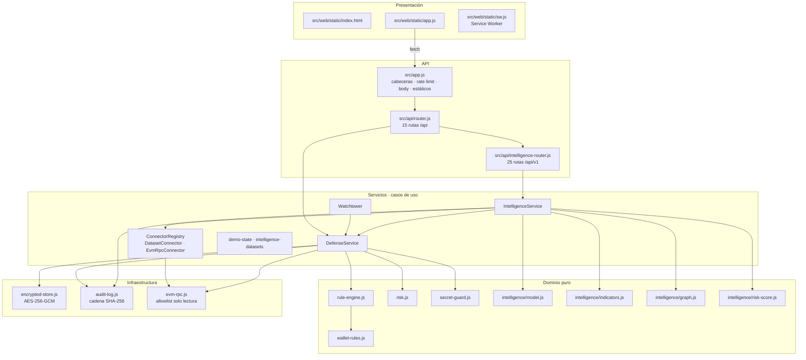
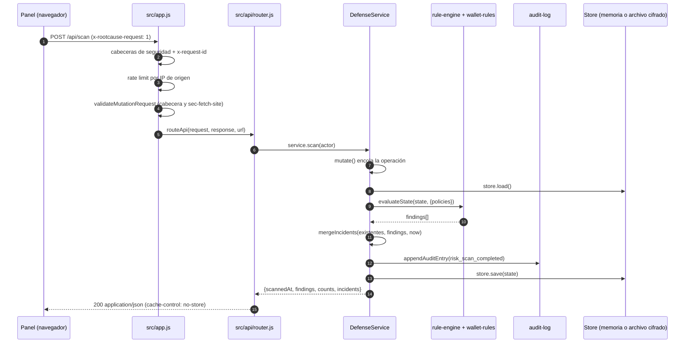
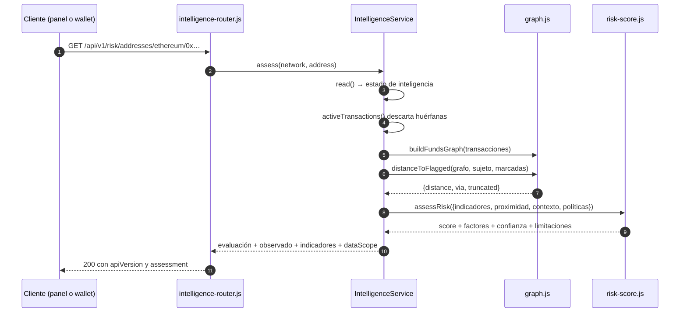
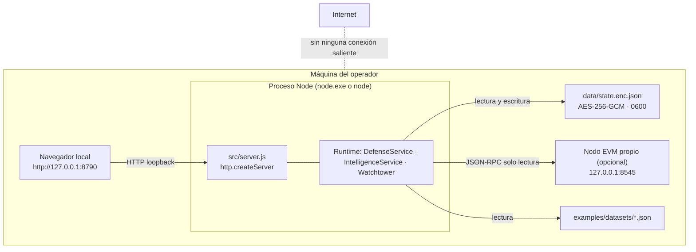

# 03 · Arquitectura

> Versión analizada: `0.3.0` · Commit `6d96e71` · Fecha: 2026-08-27
> [← Volver al índice](README.md)

La visión corta y editorial de la arquitectura está en
[`../ARCHITECTURE.md`](../ARCHITECTURE.md). Este documento la desarrolla capa a
capa, con las dependencias reales entre módulos y las decisiones que las
explican.

---

## Estilo arquitectónico

**Inferencia basada en el código.** El repositorio no usa la etiqueta, pero la
estructura corresponde a una **arquitectura por capas con dominio puro**
(*layered / hexagonal-lite*):

- el **dominio** (`src/domain/`) no importa nada que no sea `node:crypto` u otro
  módulo del propio dominio: no conoce HTTP, ni disco, ni red;
- la **infraestructura** (`src/infrastructure/`) implementa los detalles
  técnicos —cifrado, hashing, JSON-RPC— detrás de interfaces mínimas;
- los **servicios** (`src/services/`) orquestan casos de uso y son los únicos
  que combinan dominio, almacén y auditoría;
- la **API** (`src/api/`) traduce HTTP a llamadas de servicio y nada más;
- la **presentación** (`src/web/static/`) es un cliente que solo consume la API.

**Verificación de la pureza del dominio:**

~~~bash
grep -rn "^import" src/domain/
~~~

Todos los `import` del dominio son `node:crypto` o rutas relativas dentro de
`src/domain/`. **Hecho verificado.**

Hay una desviación consciente de la ortodoxia hexagonal: no existen interfaces
declaradas (no hay TypeScript). El contrato del almacén es implícito —`load()` y
`save(state)`— y lo cumplen `MemoryStore` y `EncryptedFileStore`. Es una elección
coherente con «cero dependencias y cero build», documentada en
[`../ADR-0001-plataforma-y-lenguaje.md`](../ADR-0001-plataforma-y-lenguaje.md).

---

## Diagrama de capas



**Explicación del diagrama.** Las flechas van siempre hacia abajo o hacia el
mismo nivel: **ninguna capa inferior conoce a una superior**. El dominio es la
capa más profunda y no depende de nada; la infraestructura tampoco depende de
servicios. Hay dos detalles que conviene notar. Primero, `IntelligenceService`
depende de `DefenseService` —no al revés—, porque reutiliza su cola de escritura
y su cadena de auditoría en vez de abrir un segundo camino a disco. Segundo,
`rule-engine.js` llama a `wallet-rules.js`: las reglas de wallet forman parte de
la misma evaluación, no de un motor aparte.

---

## Responsabilidad de cada capa

| Capa | Archivos | Responsabilidad | Lo que **no** hace |
|---|---|---|---|
| **Presentación** | `src/web/static/` | Renderizar el estado y disparar acciones | No calcula riesgo ni valida reglas |
| **API** | `src/app.js`, `src/api/` | Postura HTTP, enrutado, forma de la respuesta | No contiene lógica de negocio |
| **Servicios** | `src/services/` | Validar entrada, mutar estado, auditar, orquestar | No implementa reglas ni heurísticas |
| **Dominio** | `src/domain/` | Reglas, indicadores, grafo, puntaje, normalización | No toca disco, red ni HTTP |
| **Infraestructura** | `src/infrastructure/` | Cifrado, hashing, JSON-RPC | No decide nada de negocio |

---

## Diagrama de componentes y dependencias

```mermaid
graph LR
    server["server.js<br/>buildRuntime · startServer"]
    config["config.js"]
    app["app.js"]
    router["api/router.js"]
    irouter["api/intelligence-router.js"]
    defense["services/defense-service.js"]
    intel["services/intelligence-service.js"]
    conn["services/intelligence-connectors.js"]
    dsets["services/intelligence-datasets.js"]
    demo["services/demo-state.js"]
    watch["services/watchtower.js"]
    rules["domain/rule-engine.js"]
    wallet["domain/wallet-rules.js"]
    risk["domain/risk.js"]
    guard["domain/secret-guard.js"]
    model["domain/intelligence/model.js"]
    ind["domain/intelligence/indicators.js"]
    graph["domain/intelligence/graph.js"]
    score["domain/intelligence/risk-score.js"]
    store["infrastructure/encrypted-store.js"]
    audit["infrastructure/audit-log.js"]
    evm["infrastructure/evm-rpc.js"]

    server --> config
    server --> app
    server --> defense
    server --> intel
    server --> conn
    server --> dsets
    server --> demo
    server --> watch
    server --> store
    server --> evm
    server --> irouter
    app --> router
    router --> irouter
    defense --> rules
    defense --> wallet
    defense --> risk
    defense --> guard
    defense --> audit
    rules --> wallet
    intel --> defense
    intel --> model
    intel --> ind
    intel --> graph
    intel --> score
    intel --> audit
    intel --> guard
    conn --> model
    conn --> evm
    dsets --> config
    ind --> model
    graph --> model
    audit --> guard
```

**Explicación del diagrama.** `server.js` es el **único punto de composición**:
es el archivo que decide qué almacén se usa, qué conectores se registran y qué
routers se montan. Ese es el motivo de que aparezca conectado a casi todo, y es
también lo que hace testeable el resto: cualquier prueba puede construir un
`DefenseService` con un `MemoryStore` y un cliente EVM falso sin arrancar un
servidor.

Nota la ausencia de ciclos. La única relación que podría parecerlo —`intel` hacia
`defense`— es unidireccional: `DefenseService` no sabe que existe
`IntelligenceService`.

---

## Patrones de diseño identificados

**Inferencia basada en el código.** El repositorio no los nombra; los nombres
son la lectura estándar de lo que hace.

| Patrón | Dónde | Para qué |
|---|---|---|
| **Strategy** | `MemoryStore` / `EncryptedFileStore` | Cambiar la persistencia con una variable de entorno |
| **Registry** | `ConnectorRegistry` | Registrar y listar fuentes de adquisición |
| **Template Method** | `BaseConnector` + subclases | Rate limiting, reintentos y métricas comunes; `fetch*` específico |
| **Adapter** | `EvmRpcClient`, `EvmRpcConnector`, `BitcoinRpcConnector` | Traducir JSON-RPC al modelo normalizado |
| **Chain of Responsibility (light)** | `routeIntelligence` devuelve `null` y el control vuelve a `routeApi` | Componer dos routers sin acoplarlos |
| **Command queue / serialización** | `DefenseService.writeQueue` | Impedir la escritura concurrente sobre un único archivo |
| **Guard clause / Specification** | `assertNoSecretMaterial`, `validateEndpoint`, allowlists | Rechazar en el borde en vez de sanear dentro |
| **Value object inmutable** | `Object.freeze` en `loadConfig`, `NETWORKS`, `GRAPH_LIMITS` | Impedir que un módulo mute la configuración de otro |
| **Content-addressed record** | `makeEvidence` con `contentHash` | Evidencia que se puede verificar y no se puede reescribir |
| **Hash chain** | `appendAuditEntry` / `verifyAuditChain` | Detectar manipulación del registro de auditoría |

---

## Principios y prácticas de ingeniería

1. **Determinismo obligatorio.** Todos los recorridos del grafo ordenan su
   frontera (`[...frontier].sort()`, `[...graph.nodes.keys()].sort()`), y los
   identificadores de hallazgo se derivan por hash de `(código, entidad,
   discriminador)`. Consecuencia: los mismos datos producen exactamente el
   mismo resultado, en el mismo orden. Es lo que hace posible que un incidente
   conserve su identidad entre ejecuciones.
2. **Cotas explícitas en todo lo que puede crecer.** El grafo, la ingesta, las
   alertas, la evidencia y los casos tienen máximos declarados, y cuando se
   alcanzan el resultado **dice que está truncado** en vez de fingir ser
   completo.
3. **Frontera epistémica explícita.** `EPISTEMIC_LEVELS` clasifica cada dato
   como hecho observado, indicador, inferencia, hipótesis o identidad
   verificada; y el sistema **nunca** produce la última.
4. **Los invariantes se comprueban, no se prometen.** Cada afirmación fuerte del
   README tiene un script que la ejecuta y un job de CI que lo corre.
5. **Enteros, nunca coma flotante, para los montos.** `normalizeAmount` exige
   una cadena de dígitos y `formatAmount` compone el decimal con aritmética
   entera. Un redondeo en un análisis forense es un dato falso.
6. **Rechazar en vez de sanear.** Ante material secreto, un spender inválido o
   un método RPC fuera de la allowlist, la respuesta es un error, no una
   limpieza silenciosa.

---

## Flujo entre interfaz, lógica, datos e integraciones



**Explicación del diagrama.** El paso 8 es el que evita la corrupción del
estado: `mutate()` encadena la operación sobre `writeQueue`, de modo que dos
peticiones simultáneas no hacen *load-modify-save* sobre el mismo archivo a la
vez. Los pasos 10 y 11 son puros: el motor recibe un estado y una política y
devuelve hallazgos, sin efectos. `mergeIncidents` es donde ocurre la parte
interesante del ciclo de vida: un hallazgo que reaparece conserva su
`createdAt` y su estado `acknowledged`; uno que deja de aparecer pasa
automáticamente a `resolved`.

---

## Diagrama de secuencia: análisis de riesgo de una dirección



**Explicación del diagrama.** Lo relevante no es el cálculo, sino lo que
**siempre** viaja con él. `assessRisk` devuelve `factorsIncreasing`,
`factorsDecreasing`, `confidence`, `limitations`, `requiresHumanReview: true` y
`recommendation`. No existe ninguna ruta en el código que devuelva el número
solo, y `scripts/check-security-claims.js` lo comprueba en caliente
(«el puntaje nunca viaja sin explicación, límites y revisión humana»).

---

## Procesos síncronos y asíncronos

| Proceso | Naturaleza | Disparador | Módulo |
|---|---|---|---|
| Petición HTTP | Asíncrona, por petición | Cliente | `src/app.js` |
| Evaluación de reglas | **Síncrona y pura** | `scan()` o `initialize()` | `evaluateState` |
| Evaluación de indicadores | **Síncrona y pura** | `analyze()` | `evaluateIndicators` |
| Escritura de estado | Asíncrona **serializada** | Cualquier mutación | `DefenseService.mutate` |
| Instantánea del nodo | Asíncrona con timeout | `refreshNode()` o watchtower | `EvmRpcClient.snapshot` |
| Watchtower | Periódica (`setInterval`, `unref`) | `WATCHTOWER_ENABLED=true` | `src/services/watchtower.js` |
| Precarga de la demo | Asíncrona, una vez al arrancar | `DEMO_MODE=true` | `buildRuntime` |

El watchtower incluye una guarda de reentrada: si el tick anterior sigue
corriendo (`this.running`), el nuevo se descarta. **Hecho verificado** —
`Watchtower.tick`. Y usa `timer.unref()` para no impedir que el proceso termine.

---

## Manejo de estado

- **Fuente única de verdad:** un objeto de estado que el almacén carga y guarda
  entero. Las claves de primer nivel son `schemaVersion`, `projects`,
  `watchedAccounts`, `walletEvents`, `observedEvents`, `approvals`, `incidents`,
  `audit`, `node`, `updatedAt` y, cuando existe, `intelligence`.
- **Migración perezosa y segura:** `DefenseService.initialize` crea los arrays
  que falten sin tocar el resto, e `IntelligenceService.ensureState` hace lo
  mismo con el bloque de inteligencia. Un estado escrito por 0.1.0 se abre en
  0.3.0 sin conversión explícita.
- **Estado que vive solo en memoria del proceso** —y por tanto se pierde al
  reiniciar—: el contador del limitador de peticiones (`createRateLimiter`), el
  cubo de fichas de cada conector (`RateLimiter`) y las métricas de conector.
  **Inferencia basada en el código**; ver
  [15 · Riesgos y deuda técnica](15-risks-and-technical-debt.md).

---

## Manejo de errores

**Hecho verificado** — el patrón es uniforme y está centralizado en el `catch`
de `createApplication`:

1. El código de dominio o de servicio lanza un `Error` con `statusCode` y, con
   frecuencia, `code`.
2. `src/app.js` traduce: `status = Number(error.statusCode) || 500`.
3. Si `status >= 500`, se registra una línea JSON en `stderr` con
   `event: "request_failed"` **y el mensaje al cliente se sustituye** por «The
   request could not be completed.» — no se filtra el detalle interno.
4. Si `status < 500`, el mensaje sí viaja, porque describe qué envió mal el
   cliente.
5. La respuesta siempre tiene la forma `{ "error": { "code": …, "message": … } }`.

| Origen | `statusCode` | `code` típico |
|---|---|---|
| `badRequest` en los servicios | 400 | `REQUEST_REJECTED` |
| Cabecera de mutación ausente | 403 | `MUTATION_HEADER_REQUIRED` |
| Petición cross-site | 403 | `CROSS_SITE_REQUEST_REJECTED` |
| Recurso no encontrado | 404 | `NOT_FOUND` |
| Conflicto de unicidad | 409 | *(sin `code`)* |
| Cuerpo demasiado grande | 413 | *(sin `code`)* |
| Content-Type incorrecto | 415 | *(sin `code`)* |
| Material secreto | 422 | `SECRET_MATERIAL_REJECTED` |
| Límite de ritmo | 429 | `RATE_LIMITED` |
| Fallo interno | 500 | `INTERNAL_ERROR` |

El catálogo completo está en
[05 · Referencia técnica](05-technical-reference.md#códigos-de-error).

---

## Autenticación y autorización

**No existen dentro de la aplicación, y es deliberado.**

El modelo de confianza es: *la aplicación corre en la máquina del operador, en
loopback; quien tiene acceso a esa máquina y a ese puerto es el operador*. Los
controles que sí existen son de **integridad de origen**, no de identidad:

| Control | Implementación | Qué impide |
|---|---|---|
| Bind loopback por defecto | `HOST=127.0.0.1` | Exposición accidental a la red |
| Cabecera `x-rootcause-request: 1` obligatoria en toda mutación | `validateMutationRequest` | Que una página web cualquiera dispare una mutación con un formulario |
| Rechazo por `sec-fetch-site` | `validateMutationRequest` | Mutaciones cross-site desde un navegador moderno |
| CSP `frame-ancestors 'none'` + `X-Frame-Options: DENY` | `applySecurityHeaders` | Clickjacking |
| Límite de ritmo por dirección de origen | `createRateLimiter` | Fuerza bruta y abuso local |
| `x-rootcause-actor` como **etiqueta de auditoría** | `actorFrom` en `src/api/router.js` | Nada: es trazabilidad, no autenticación |

**Advertencia explícita.** `x-rootcause-actor` **no autentica a nadie**: solo
sirve para que la entrada de auditoría diga quién dijo ser el autor. Exponer la
aplicación fuera de loopback sin poner un proxy autenticado delante equivale a
dar control total del inventario a quien alcance el puerto. Ver
[11 · Seguridad](11-security.md) y [`../THREAT_MODEL.md`](../THREAT_MODEL.md).

---

## Persistencia y caché

- **Persistencia:** un archivo JSON cifrado con AES-256-GCM, escrito de forma
  atómica (temporal + `rename`), con permisos `0600` y directorio `0700`. En
  modo demostración, memoria pura. Detalle en
  [07 · Persistencia](07-database.md).
- **Caché de servidor:** ninguna. No hay memoización del grafo ni de las
  evaluaciones; cada consulta reconstruye lo que necesita.
  `intelligence-policies.json` declara `api.assessmentCacheSeconds: 60`, pero
  **ese valor no se lee en ninguna parte del código**: es una intención, no un
  comportamiento. **Hecho verificado** por búsqueda de `assessmentCacheSeconds`
  en `src/`.
- **Caché de cliente:** el Service Worker (`src/web/static/sw.js`) cachea los
  estáticos con estrategia *network-first, cache-fallback*, y **excluye
  explícitamente** todo lo que empiece por `/api/`. Las respuestas de API se
  sirven con `cache-control: no-store`.

---

## Procesos en segundo plano

Solo uno: el **watchtower**. Deshabilitado por defecto. Cuando se activa,
refresca la instantánea del nodo y ejecuta un análisis cada
`WATCHTOWER_INTERVAL_MS` milisegundos (mínimo 5000, máximo 3 600 000). Sus
errores se registran en `stderr` como `watchtower_tick_failed` y **no derriban el
proceso**.

---

## Diagrama de despliegue



**Explicación del diagrama.** Todo el despliegue cabe en una máquina. La única
conexión saliente posible es hacia un nodo EVM, que por defecto tiene que ser
loopback: `validateEndpoint` rechaza cualquier host que no sea `127.0.0.1`,
`::1` o `localhost` salvo que se ponga `EVM_ALLOW_REMOTE_RPC=true`
explícitamente. No hay telemetría, no hay actualizaciones automáticas y no hay
llamada a ningún servicio de reputación.

En despliegue contenedorizado, el proceso escucha en `0.0.0.0` **dentro** del
contenedor, pero `compose.yaml` publica el puerto solo en `127.0.0.1` del
anfitrión.

---

## Diagrama de entidades

El sistema no tiene base de datos relacional, pero su estado sí tiene una
estructura de entidades con relaciones. Ver
[07 · Persistencia y modelo de almacenamiento](07-database.md#diagrama-de-entidades),
donde está el diagrama entidad-relación completo y el diccionario de datos.

---

## Límite entre los dos dominios

Una decisión de arquitectura que conviene entender antes de tocar código: hay
**dos motores distintos que responden a dos preguntas distintas**, y comparten
almacén y auditoría pero no vocabulario.

| | Defensa (`BLK-*`) | Inteligencia (`INT-*`) |
|---|---|---|
| Pregunta | «¿Mi configuración incumple mi política?» | «¿Este movimiento merece que lo mire una persona?» |
| Salida | **Incidente** con causa raíz y remediación | **Indicador** → alerta → caso |
| Naturaleza | Violación de política | Señal investigable, no acusación |
| Catálogo | `config/control-catalog.json` (13 controles) | `config/intelligence-indicators.json` (6 familias) |
| Política | `config/policies.json` | `config/intelligence-policies.json` |
| Estado | Raíz del objeto de estado | Bloque `state.intelligence` |
| Documentación | [`../HEURISTICAS.md`](../HEURISTICAS.md) | [`../ONCHAIN-ANALYTICS.md`](../ONCHAIN-ANALYTICS.md) |

`scripts/check-rule-coverage.js` verifica ambos catálogos por separado y **no
permite que se mezclen**.

---

## Documentos relacionados

- [04 · Mapa del código](04-code-map.md)
- [06 · Explicación profunda del código](06-deep-code-explanation.md)
- [08 · Flujo de datos](08-data-flow.md)
- [`../ARCHITECTURE.md`](../ARCHITECTURE.md) — versión breve del proyecto
- [`../ADR-0001-plataforma-y-lenguaje.md`](../ADR-0001-plataforma-y-lenguaje.md)
- [`../ADR-0002-almacenamiento-inteligencia.md`](../ADR-0002-almacenamiento-inteligencia.md)
<!-- navegacion -->
---

**[← 02 · Instalación y ejecución](02-installation-and-execution.md)** · **[Índice](README.md)** · **[04 · Mapa completo del código →](04-code-map.md)**
