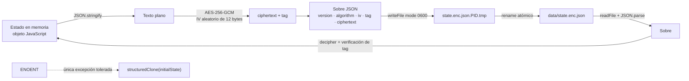
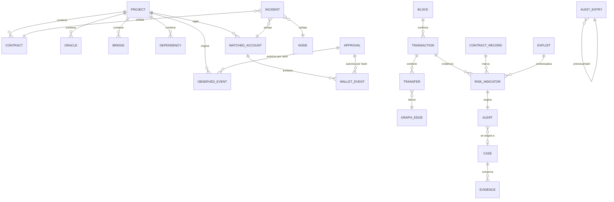

# 07 · Persistencia y modelo de almacenamiento

> Versión analizada: `0.3.0` · Commit `6d96e71` · Fecha: 2026-08-27
> [← Volver al índice](README.md)

## No hay base de datos, y es una decisión

**Hecho verificado.** El repositorio **no contiene** ningún motor de base de
datos, ningún cliente de base de datos, ningún esquema SQL, ninguna migración y
ninguna cadena de conexión. La comprobación es directa: `package.json` no
declara dependencias y `scripts/check-local-only.js` impide que las declare.

| Elemento buscado | Resultado |
|---|---|
| Motor relacional o documental | **No identificado** |
| Archivos `.sql` | **No identificado** |
| Migraciones | **No identificado** |
| ORM o query builder | **No identificado** |
| Procedimientos almacenados, vistas, triggers, índices | **No aplican** |
| Cadena de conexión | **No identificado** |

La decisión está razonada en
[`../ADR-0002-almacenamiento-inteligencia.md`](../ADR-0002-almacenamiento-inteligencia.md),
que además declara **cuándo habría que revisarla**.

---

## Cuál es el mecanismo de persistencia

Un **único archivo JSON cifrado con AES-256-GCM**, que contiene el estado
completo de la aplicación.

| Aspecto | Valor |
|---|---|
| Ruta | `config.dataFile` = `<DATA_DIR>/state.enc.json` (por defecto `./data/state.enc.json`) |
| Formato | JSON con el sobre de cifrado |
| Algoritmo | `aes-256-gcm` |
| Clave | `ROOTCAUSE_DATA_KEY`, exactamente 32 bytes tras decodificar hex o base64 |
| IV | 12 bytes aleatorios **por cada escritura** |
| Autenticación | Tag GCM: detecta manipulación del archivo |
| Permisos | Archivo `0600`, directorio `0700` |
| Escritura | Atómica: temporal con el PID + `rename` |
| Implementación | `EncryptedFileStore` en `src/infrastructure/encrypted-store.js` |

En modo demostración (`DEMO_MODE=true`) el almacén es `MemoryStore`: nada toca
el disco y **todo se pierde al cerrar**.

### Sobre de cifrado

~~~json
{
  "version": 1,
  "algorithm": "aes-256-gcm",
  "iv": "<12 bytes en base64>",
  "tag": "<16 bytes en base64>",
  "ciphertext": "<estado JSON cifrado, en base64>"
}
~~~

`decryptJson` rechaza cualquier sobre cuya `version` no sea `1` o cuyo
`algorithm` no coincida. Es lo que permitirá introducir una versión 2 sin
descifrar mal un archivo antiguo.

---

## Diagrama de la persistencia

**Explicación del diagrama.** El texto plano existe **solo en memoria**: se cifra
antes de escribir y se descifra después de leer. La escritura pasa por un
archivo temporal cuyo nombre incluye el PID —dos procesos no colisionan— y el
paso final es un `rename`, que en el mismo sistema de archivos es atómico: el
archivo de estado nunca queda a medias. Si el proceso muere durante la
escritura, sobrevive el estado anterior íntegro y queda un `.tmp` huérfano.

En la lectura, la única condición de error que se convierte en «empieza de cero»
es `ENOENT`. Un fallo de descifrado, un JSON corrupto o un problema de permisos
**se propagan y detienen el arranque**, porque arrancar vacío tras un fallo de
descifrado equivaldría a borrar el inventario en silencio.

---

## Diccionario de datos · estado raíz

| Campo | Tipo | Obligatorio | Descripción | Creado por |
|---|---|---|---|---|
| `schemaVersion` | entero | Sí | Versión del esquema. Valor actual: `2` | `createEmptyState` |
| `projects` | array | Sí | Inventario de aplicaciones blockchain | `addProject` |
| `watchedAccounts` | array | Sí | Cuentas públicas vigiladas | `addWatchedAccount` |
| `walletEvents` | array | Sí | Eventos wallet normalizados | `observeWalletEvent` |
| `observedEvents` | array | Sí | Eventos de proyecto observados | `observeEvent` |
| `approvals` | array | Sí | Hashes de cambio aprobados | `approvePolicyHash` |
| `incidents` | array | Sí | Incidentes con su ciclo de vida | `mergeIncidents` |
| `audit` | array | Sí | Cadena de auditoría | `appendAuditEntry` |
| `node` | objeto | Sí | Última instantánea del observador | `refreshNode` |
| `intelligence` | objeto | No | Bloque de inteligencia; se crea al primer uso | `ensureState` |
| `updatedAt` | ISO-8601 | Sí | Momento de la última escritura | `mutate` |

### `projects[]`

| Campo | Tipo | Validación |
|---|---|---|
| `id` | UUID | `crypto.randomUUID()` |
| `name` | texto ≤ 120 | obligatorio, sin caracteres de control |
| `chain.family` | enum | `FAMILIES` |
| `chain.network` | texto ≤ 60 | por defecto `unknown` |
| `chain.chainId` | texto ≤ 60 | por defecto `unknown` |
| `environment` | enum | `ENVIRONMENTS`, por defecto `production` |
| `criticality` | enum | `CRITICALITIES`, por defecto `medium` |
| `status` | enum | `PROJECT_STATUSES`, por defecto `active` |
| `contracts[]` | array ≤ 100 | direcciones únicas dentro del proyecto |
| `oracles[]` | array ≤ 100 | — |
| `bridges[]` | array ≤ 100 | `threshold ≤ signerCount` |
| `dependencies[]` | array ≤ 200 | — |
| `governance.model` | enum | `GOVERNANCE_MODELS` |
| `governance.timelockSeconds` | entero | 0 – 315 360 000 (10 años) |
| `tags[]` | array ≤ 20 | cada etiqueta ≤ 30 caracteres |

**Unicidad:** `(name en minúsculas, chain.family, chain.chainId)`. Un duplicado
devuelve 409.

#### `projects[].contracts[]`

| Campo | Tipo | Nota |
|---|---|---|
| `id` | UUID | — |
| `name` | texto ≤ 100 | — |
| `address` | identificador público | EVM: `0x` + 40 hex, normalizado a minúsculas |
| `kind` | texto ≤ 60 | libre |
| `verifiedSource` | booleano | dispara `BLK-CONTRACT-001` si es falso |
| `bytecodeHash` | texto ≤ 100 o `null` | — |
| `upgradeable` | booleano | — |
| `upgradeDelaySeconds` | entero | 0 – 315 360 000 |
| `admin.type` | enum | `ADMIN_TYPES`; `eoa` dispara `BLK-ACCESS-001` |
| `admin.owners` / `admin.threshold` | entero 0–1000 | `threshold ≤ owners` en multisig |

#### `projects[].oracles[]`

`id`, `name`, `providerCount`, `heartbeatSeconds`, `lastUpdateAt` (ISO o `null`),
`fallbackAvailable`. Un `lastUpdateAt` ausente o un `heartbeatSeconds` de cero
**disparan** `BLK-ORACLE-002`.

#### `projects[].bridges[]`

`id`, `name`, `validationModel`, `signerCount`, `threshold`,
`independentOperators`, `pauseAvailable`.

#### `projects[].dependencies[]`

`name`, `version`, `pinned`, `provenanceVerified`.

### `watchedAccounts[]`

| Campo | Tipo | Nota |
|---|---|---|
| `id` | UUID | — |
| `projectId` | texto ≤ 80 | **debe** referenciar un proyecto registrado |
| `chainId` | texto ≤ 60 | por defecto `"1"` |
| `address` | dirección EVM | normalizada a minúsculas |
| `accountType` | enum | `ACCOUNT_TYPES` |
| `purpose` | texto ≤ 160 | descripción operativa |
| `criticality` | enum | `CRITICALITIES` |
| `expectedActivity.description` | texto ≤ 200 | — |
| `expectedActivity.activeHours` | `{startHour 0-23, endHour 0-24}` o `null` | ventana horaria declarada |
| `allowedSpenders[]` | ≤ 100 direcciones | — |
| `knownCounterparties[]` | ≤ 100 direcciones | — |
| `allowedTokenContracts[]` | ≤ 100 direcciones | — |
| `approvalPolicies[]` | ≤ 100 | `{tokenContract, maximumAllowanceRaw, maximumAgeDays}` |
| `dormancyPolicy.dormantAfterDays` | entero 0–3650 | — |
| `smartAccountPolicy` | objeto | `expectedOwners`, `expectedGuardians`, `expectedModules`, `expectedThreshold`, `expectedImplementation`, `expectedDelegate`, `allowedChainIds` |
| `tags[]` | ≤ 20 | — |
| `createdAt` / `updatedAt` | ISO-8601 | — |

**Unicidad:** `(address, chainId)`.

> **Nota de privacidad, verificada en el código.** Esta entidad **no tiene**
> campo para nombre real, correo, teléfono, ubicación, biometría ni material de
> respaldo. `normalizeWatchedAccount` construye el objeto campo a campo, así que
> cualquier propiedad extra que se envíe **se descarta**: no llega al estado.

### `walletEvents[]`

Campos comunes a los 7 tipos: `id`, `type`, `chainId`, `blockNumber`,
`blockHash`, `transactionHash` (**obligatorio**), `logIndex`, `walletAddress`,
`contractAddress`, `spender`, `operator`, `amountRaw`, `decimals`, `source`,
`destination`, `confidence`, `observedAt`.

Campos añadidos según el tipo:

| Tipo | Campos adicionales |
|---|---|
| `wallet.allowance.changed` | exige `contractAddress`, `spender`, `amountRaw` |
| `wallet.operator.changed` | `approved`, `approvalScope`, `tokenStandard` |
| `wallet.permit.used` | `permitStandard`, `deadline` |
| `wallet.transfer.observed` | `direction`, `sourceAddress` |
| `wallet.smart-account.changed` | `changeKind`, `subject`, `newThreshold`, `approvalHash` |
| `wallet.delegation.changed` | `delegate`, `approvalHash` |
| `wallet.activity.observed` | `counterparty`, `kind` |

**Clave de idempotencia:** `(chainId, transactionHash, logIndex)`.

> **Detalle de diseño digno de mención.** `source` es la procedencia del
> colector; la dirección de origen de una transferencia viaja en `sourceAddress`.
> El código lo comenta explícitamente para no mezclarlas.

### `observedEvents[]`

`id`, `type` (`privileged_role_change` | `value_outflow`), `projectId`,
`contractAddress`, `actor`, `approvalHash`, `amountUsd`, `baselineUsd`,
`blockNumber`, `transactionHash`, `approved`, `source`, `observedAt`.

### `approvals[]`

`id`, `hash` (SHA-256 en minúsculas, con `sha256:` opcional que se elimina),
`purpose`, `approvedBy`, `approvedAt`. Un hash ya presente **no se duplica**.

### `incidents[]`

Los campos del hallazgo (`id`, `code`, `entityType`, `entityId`, `severity`,
`title`, `explanation`, `rootCause`, `evidence`, `remediation`, y en wallet
también `confidence`, `policyViolated`, `impact`, `limitations`) más el ciclo de
vida: `status`, `createdAt`, `lastSeenAt`, `detectedAt`, `acknowledgedAt`,
`acknowledgedBy`, `resolvedAt`, `resolvedBy`.

**Clave primaria:** `id`, derivado por hash de `(code, entityId, discriminator)`.
Es lo que da continuidad al incidente entre ejecuciones.

### `audit[]`

`id` (UUID), `occurredAt`, `actor`, `action`, `entityType`, `entityId`,
`metadata` (**redactada**), `previousHash`, `hash`.

**Integridad:** `verifyAuditChain` recorre la cadena y devuelve
`{valid, entries, head}` o `{valid: false, brokenAt, reason}`.

### `node`

`id`, `family`, `endpoint`, `connected`, `expectedChainId`, `chainId`,
`blockNumber`, `latestObservedBlockNumber`, `blockTimestamp`, `clientVersion`,
`checkedAt`. Si la consulta falla, en lugar de los campos de datos aparece
`error` con el mensaje truncado a 240 caracteres.

---

## Diccionario de datos · bloque `intelligence`

Creado por `createEmptyIntelligenceState()` con `schemaVersion: 1`.

| Campo | Tipo | Cota | Contenido |
|---|---|---|---|
| `blocks[]` | array | 5000 | Bloques normalizados; los reorganizados llevan `orphaned` |
| `transactions[]` | array | 20000 | Transacciones normalizadas |
| `registries.contracts[]` | array | — | Contratos y tokens etiquetados localmente |
| `registries.drainers[]` | array | — | Direcciones marcadas como drainer (siempre `flagged`) |
| `registries.bridges[]` | array | — | Puentes conocidos |
| `registries.exploits[]` | array | — | Exploits registrados con su fecha |
| `indicators[]` | array | 5000 | Resultado del último `analyze()` |
| `assessments[]` | array | — | Declarado en el estado; **no se escribe en ningún punto** |
| `alerts[]` | array | 2000 | Alertas con su historial |
| `cases[]` | array | 500 | Casos de investigación |
| `evidence[]` | array | 5000 | Evidencia sellada por hash |
| `ingestion.runs[]` | array | 100 | Últimas ejecuciones de ingesta con sus estadísticas |
| `ingestion.lastRunAt` | ISO-8601 | — | — |
| `ingestion.reorgs[]` | array | — | Reorganizaciones detectadas |

> **Hallazgo del análisis.** `assessments[]` se crea en
> `createEmptyIntelligenceState` y se garantiza como array en `ensureState`,
> pero **ningún método escribe en él**: `assess()` calcula y devuelve sin
> persistir. Es coherente con no cachear, pero deja un campo muerto en el
> estado. Registrado en
> [15 · Riesgos y deuda técnica](15-risks-and-technical-debt.md).

### Entidades del bloque de inteligencia

| Entidad | Clave | Campos destacados |
|---|---|---|
| `Block` | `network:hash` | `height`, `parentHash`, `timestamp`, `epistemicLevel`, `source`, `orphaned?`, `replacedBy?` |
| `Transaction` | `network:txid` | `blockHash`, `blockHeight`, `feeRaw`, `inputs[]`, `outputs[]`, `transfers[]`, `contractAddress`, `method`, `source`, `orphaned?` |
| `ContractRecord` | `network:address` | `label`, `category`, `flagged`, `flagReason`, `epistemicLevel`, `confidence` |
| `Exploit` | `stableId("exploit", …)` | `network`, `address`, `label`, `occurredAt`, `description` |
| `RiskIndicator` | `stableId("indicator", …)` | `indicator`, `family`, `subject`, `severity`, `confidence`, `evidence`, `falsePositives`, `thresholdsApplied`, `source` |
| `Alert` | `stableId("alert", indicatorHitId)` | `indicatorHitId`, `status`, `assignedTo`, `caseId`, `history[]`, `falsePositiveReason?` |
| `InvestigationCase` | `stableId("case", título, instante)` | `status`, `priority`, `alertIds[]`, `evidenceIds[]`, `notes[]`, `decisions[]`, `timeline[]` |
| `Evidence` | `stableId("evidence", kind, contentHash)` | `payload`, `contentHash`, `algorithm`, `immutable: true`, `collectedBy`, `collectedAt` |

El detalle campo a campo de estas entidades, con sus niveles epistémicos, está
en [`../DATA-MODEL.md`](../DATA-MODEL.md).

---

## Diagrama de entidades

**Explicación del diagrama.** La mitad superior es el dominio de **defensa**: un
proyecto agrupa contratos, oráculos, puentes y dependencias, y vigila cuentas.
Los eventos y los eventos wallet se relacionan con las aprobaciones **por hash**,
no por clave foránea: una aprobación registrada es lo que convierte un cambio
privilegiado observado en un cambio esperado. La cadena de auditoría se
autorreferencia con `previousHash`.

La mitad inferior es el dominio de **inteligencia**: los bloques confirman
transacciones, las transacciones contienen transferencias, y de las
transferencias se derivan las aristas del grafo. Un indicador se apoya en
transacciones concretas y genera exactamente una alerta; las alertas se agrupan
en casos y los casos conservan evidencia. Los registros locales de contratos y
los exploits no producen indicadores por sí solos: **contextualizan** los que
producen las transacciones.

**Nota importante:** este diagrama describe **relaciones lógicas**, no tablas.
No existe integridad referencial impuesta por un motor. Las dos únicas
comprobaciones de referencia que hace el código son:

1. `addWatchedAccount` exige que `projectId` referencie un proyecto registrado;
2. `observeWalletEvent` exige que `walletAddress` referencie una cuenta vigilada.

Todo lo demás es coherencia por construcción. **Inferencia basada en el código.**

---

## Consultas relevantes

No hay lenguaje de consulta. Las «consultas» son proyecciones en memoria:

| Consulta | Implementación | Coste |
|---|---|---|
| Último allowance por (cadena, wallet, token, spender) | `latestAllowances` | `O(n log n)` por el ordenado |
| Último operador por clave equivalente | `latestOperators` | `O(n log n)` |
| Transacciones activas (sin huérfanas) | `activeTransactions` | `O(n)` |
| Indicadores de un sujeto | `filter` sobre `indicators` | `O(n)` |
| Alertas por estado o sujeto | `filter` + `sort` | `O(n log n)` |
| Grafo de fondos | `buildFundsGraph` | `O(transferencias log …)` |
| Verificación de la auditoría | `verifyAuditChain` | `O(entradas)` con un SHA-256 cada una |

**Consecuencia operativa:** todo el estado se carga en memoria en cada mutación
y en cada lectura. Con las cotas actuales (20 000 transacciones, 2000 alertas,
5000 evidencias) es asumible en un equipo de escritorio, y es exactamente el
escenario para el que `../ADR-0002-almacenamiento-inteligencia.md` dice que
habría que revisar la decisión.

---

## Transacciones (en el sentido de base de datos)

No hay transacciones ACID. Lo que hay es:

| Propiedad | Cómo se consigue | Alcance |
|---|---|---|
| **Atomicidad** de la escritura | `rename` sobre el archivo final | Completa, dentro del mismo sistema de archivos |
| **Aislamiento** entre operaciones | `DefenseService.writeQueue` | Solo dentro del mismo proceso |
| **Consistencia** | Validación en el borde + normalizadores | Por construcción |
| **Durabilidad** | `fs.writeFile` sin `fsync` explícito | **Requiere validación:** un corte de energía justo tras el `rename` podría perder la escritura si el sistema operativo aún no la había volcado |

**Limitación explícita:** dos procesos apuntando al mismo `DATA_DIR` pueden
pisarse las escrituras. No hay bloqueo de archivo. Registrado en
[15 · Riesgos y deuda técnica](15-risks-and-technical-debt.md).

---

## Reglas de integridad

| Regla | Dónde se impone |
|---|---|
| Proyecto único por `(nombre, familia, chainId)` | `addProject` → 409 |
| Direcciones de contrato únicas dentro de un proyecto | `normalizeProject` → 400 |
| Cuenta única por `(dirección, chainId)` | `addWatchedAccount` → 409 |
| `threshold ≤ owners` en multisig | `normalizeContract` → 400 |
| `threshold ≤ signerCount` en puentes | `normalizeBridge` → 400 |
| Evento wallet idempotente por `(chainId, txHash, logIndex)` | `observeWalletEvent` |
| Transacción idempotente por `network:txid` | `ingest` |
| Bloque idempotente por `network:hash` | `ingest` |
| Aprobación única por `hash` | `approvePolicyHash` |
| Evidencia única por `id` derivado del contenido | `attachEvidence` |
| Cadena de auditoría encadenada | `appendAuditEntry` |

---

## Datos sensibles

**Hecho verificado.** El sistema está construido para **no** almacenar datos
sensibles, y esa propiedad tiene tres capas:

1. **Rechazo en el borde.** `assertNoSecretMaterial` lanza 422 ante material
   privado por nombre de campo o por patrón de contenido.
2. **Ausencia de campos.** Las entidades no tienen dónde guardar datos
   personales: los normalizadores construyen el objeto campo a campo y descartan
   todo lo demás.
3. **Redacción en la auditoría.** `redactForAudit` sustituye por `[REDACTED]` y
   trunca a 512 caracteres antes de hashear.

Lo que **sí** contiene el estado y merece protección:

| Dato | Por qué importa |
|---|---|
| Inventario completo de contratos y direcciones | Revela qué controla la organización y dónde están sus puntos débiles |
| Cuentas públicas vigiladas y sus políticas | Revela el modelo operativo y los límites declarados |
| Incidentes abiertos | Es un mapa de las debilidades conocidas y aún no corregidas |
| Registros locales de marcado y casos | Revela **qué se está investigando**, lo que puede ser tan sensible como el resultado |

Ese es exactamente el motivo de que el archivo esté cifrado y de que el producto
no consulte listas de reputación externas.

---

## Políticas de respaldo y recuperación

**No documentado en el repositorio.** No hay script de respaldo, ni rotación de
clave, ni procedimiento de restauración. **Requiere validación** con el
mantenedor.

Recomendación mínima, como **inferencia** de cómo funciona el almacén:

1. El respaldo es copiar `data/state.enc.json`. Está cifrado en reposo, así que
   la copia hereda la protección — **pero es inútil sin la clave**.
2. La clave debe respaldarse **por separado** y en un gestor de secretos. Sin
   ella el archivo es irrecuperable: no hay recuperación de AES-256-GCM.
3. La restauración es copiar el archivo de vuelta con el proceso detenido.
4. **No hay rotación de clave implementada.** Cambiarla exigiría descifrar con
   la anterior y volver a cifrar con la nueva; el repositorio no ofrece esa
   utilidad.

---

## Documentos relacionados

- [08 · Flujo de datos](08-data-flow.md)
- [11 · Seguridad](11-security.md)
- [`../DATA-MODEL.md`](../DATA-MODEL.md) — entidades de inteligencia en detalle
- [`../DATA-GOVERNANCE.md`](../DATA-GOVERNANCE.md) — qué entra, cuánto se conserva
- [`../ADR-0002-almacenamiento-inteligencia.md`](../ADR-0002-almacenamiento-inteligencia.md)
<!-- navegacion -->
---

**[← 06 · Explicación profunda del código](06-deep-code-explanation.md)** · **[Índice](README.md)** · **[08 · Flujo de datos →](08-data-flow.md)**
