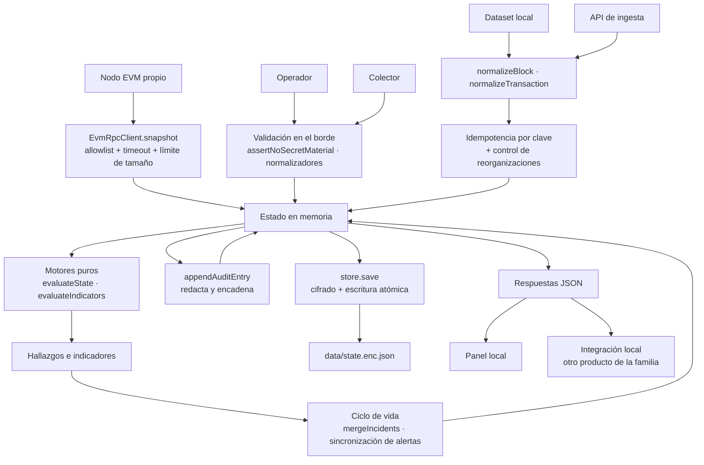
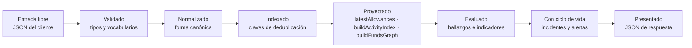

# 08 · Flujo de datos

> Versión analizada: `0.3.0` · Commit `6d96e71` · Fecha: 2026-08-27
> [← Volver al índice](README.md)

Este documento sigue el dato desde su origen hasta su presentación, y señala
dónde puede perderse, corromperse o quedar inconsistente. La política de
gobierno del dato está en [`../DATA-GOVERNANCE.md`](../DATA-GOVERNANCE.md).

---

## De dónde provienen los datos

**Hecho verificado** — hay exactamente cinco orígenes, y ninguno es un servicio
remoto de terceros.

| Origen | Naturaleza | Fiabilidad declarada | Entra por |
|---|---|---|---|
| **Operador humano** | Declarativo | — | `POST /api/projects`, `/api/accounts`, `/api/approvals` |
| **Colector externo** | Hechos on-chain normalizados | — | `POST /api/observe/event` |
| **Nodo EVM propio** | Observación directa | `own-node: 1.0` | `EvmRpcClient.snapshot()`, `EvmRpcConnector` |
| **Dataset local** | Fixture reproducible | `local-dataset: 0.9` | `examples/datasets` vía `ingestDataset` |
| **API de ingesta** | Lote de bloques y transacciones | Según `source.kind` | `POST /api/v1/intelligence/ingest` |

La escala de fiabilidad completa (`SOURCE_RELIABILITY`) va de `own-node: 1.0` a
`unknown: 0.3`, y **se propaga hasta el puntaje final**: un indicador construido
sobre una fuente de fiabilidad 0,3 no puede alcanzar confianza alta, y además
resta puntos por la penalización de fiabilidad.

---

## Diagrama del flujo completo

**Explicación del diagrama.** Hay dos entradas con tratamiento distinto. Lo
**declarativo** (operador, colector) pasa por validación estricta y va directo al
estado. Lo **observado** (dataset, API de ingesta) pasa además por el control de
idempotencia y de reorganizaciones, porque una transacción puede llegar dos
veces o pertenecer a un bloque que la cadena luego descartó.

Los motores son puros: reciben estado y devuelven hallazgos. El paso siguiente
—el ciclo de vida— es el que convierte un hallazgo instantáneo en un incidente
con historia. Todo lo que muta pasa por la auditoría **antes** de guardarse, y el
guardado cifra.

Nota lo que **no** hay: ninguna flecha sale del recuadro hacia Internet.

---

## Cómo se validan los datos

La validación ocurre **una sola vez, en el borde**, y con rechazo en lugar de
saneamiento. Después de ese punto, el dominio asume que el dato es válido.

### Capas de validación, en orden

| # | Capa | Qué comprueba | Fallo |
|---|---|---|---|
| 1 | `src/app.js` | Content-Type, tamaño del cuerpo, JSON parseable, cabecera de mutación | 415, 413, 400, 403 |
| 2 | `assertNoSecretMaterial` | Material privado por nombre y por contenido | 422 |
| 3 | Validadores de tipo | `text`, `integer`, `enumValue`, `isoDate`, `evmAddress`, `rawAmount`… | 400 |
| 4 | Normalizadores | Construyen la entidad **campo a campo** | 400 |
| 5 | Reglas de negocio | Unicidad, referencias, coherencia de umbrales | 400 / 409 |

### El principio de la lista blanca de campos

Los normalizadores no copian el objeto recibido: lo **reconstruyen**. Un campo
que el normalizador no menciona sencillamente no llega al estado. Consecuencia
directa: no hay contaminación de propiedades, no hay campos ocultos, y añadir un
campo nuevo exige tocar el normalizador —es decir, exige una decisión explícita.

### Validaciones que merecen destacarse

| Validación | Función | Por qué importa |
|---|---|---|
| Dirección EVM | `evmAddress` | Exige `0x` + 40 hex y normaliza a minúsculas: dos escrituras de la misma dirección no producen dos entidades |
| Dirección Bitcoin | `normalizeAddress` | **Verifica el checksum de verdad**: base58check con doble SHA-256, bech32/bech32m con la constante correcta |
| Monto | `rawAmount` / `normalizeAmount` | Solo dígitos, hasta 78: entero en unidades mínimas, nunca coma flotante |
| Hash de transacción | `optionalTransactionHash` | 32 bytes en minúsculas |
| Hash de aprobación | `optionalApprovalHash` | SHA-256, admite y elimina el prefijo `sha256:` |
| Fecha | `isoDate` | Se guarda siempre en ISO-8601 UTC |
| Identificador de dataset | `DATASET_ID` + comprobación de ruta | Único punto donde entrada de usuario participa en una ruta de archivo |

---

## Cómo se transforman los datos

**Explicación del diagrama.** Cada paso reduce la libertad del dato. La entrada
puede tener cualquier forma; lo normalizado tiene exactamente los campos que el
modelo define; lo indexado tiene una clave estable; lo proyectado es una vista
derivada que se recalcula y nunca se persiste; lo evaluado son hallazgos; y el
ciclo de vida les añade la historia.

Las **proyecciones no se guardan**. `latestAllowances`, el índice de actividad y
el grafo se reconstruyen en cada uso. Ventaja: nunca hay una vista derivada
obsoleta. Coste: se recalculan, y en el caso del grafo eso es la operación más
cara de la API.

### Transformaciones concretas

| Transformación | Entrada → salida | Módulo |
|---|---|---|
| Dirección a forma canónica | `0xABC…` → `0xabc…` | `evmAddress`, `normalizeAddress` |
| UTXO a transferencias | `inputs[] + outputs[]` → `transfers[]` marcadas `utxo-derived` | `normalizeTransaction` |
| Eventos a estado actual | Lista de eventos → último por clave | `latestAllowances`, `latestOperators` |
| Transacciones a grafo | `transfers[]` → nodos y aristas | `buildFundsGraph` |
| Hallazgos a incidentes | Lista instantánea → entidades con historia | `mergeIncidents` |
| Indicadores a alertas | Indicador → alerta con `history` | `analyze` |
| Monto crudo a decimal | `"123456789"`, 8 → `"1.23456789"` | `formatAmount` |
| Hallazgos a puntaje | Lista → número 0–100 con banda | `riskScore` / `assessRisk` |

---

## Dónde se almacenan

Un único archivo cifrado. Ver [07 · Persistencia](07-database.md).

Datos que **no** se almacenan y se recalculan siempre:

- el grafo de fondos;
- las proyecciones de allowances y operadores;
- el índice de actividad;
- las evaluaciones de riesgo (`assess()` no persiste su resultado);
- el resumen de postura de wallets.

---

## Qué componentes los consumen

| Consumidor | Datos que lee | Endpoint |
|---|---|---|
| Panel — vista Postura | riesgo, totales, ruta causal, nodo | `/api/summary` |
| Panel — vista Incidentes | incidentes con evidencia y remediación | `/api/summary`, `/api/incidents` |
| Panel — vista Wallet | `walletPosture`, cuentas, incidentes `BLK-WALLET-*` | `/api/summary` |
| Panel — vista Intelligence | resumen, alertas, casos, evaluación, grafo | `/api/v1/intelligence/*` |
| Panel — vista Inventario | proyectos y contratos | `/api/summary` |
| Panel — vista Controles | catálogo de los 13 controles | `/api/controls` |
| Watchtower | estado completo, indirectamente | interno |
| Auditor | cadena de auditoría y su verificación | `/api/audit` |
| Integración de la familia | evaluación de riesgo | `/api/v1/risk/...` |

---

## Qué información se envía a servicios externos

**Ninguna.** Es una propiedad verificada, no una declaración de intenciones:

| Comprobación | Gate |
|---|---|
| El panel no referencia ningún origen remoto | `scripts/check-local-only.js` |
| La CSP no admite orígenes externos | `scripts/check-local-only.js` |
| Ningún archivo de `src/` menciona un proveedor RPC alojado | `scripts/check-local-only.js` |
| El dominio de inteligencia no consulta listas remotas de reputación | `scripts/check-security-claims.js` |
| No hay dependencias que puedan llamar a casa | `scripts/check-local-only.js` |

La única salida de red posible es hacia un nodo EVM que el operador configura y
que por defecto **debe ser loopback**.

### Por qué esto es una decisión de producto y no solo de privacidad

Consultar una lista externa de reputación implicaría enviar a un tercero la
dirección que se está investigando. En una investigación de seguridad eso es
información de primer orden: revela qué caso está abierto, qué víctima está
implicada y desde cuándo. Por eso los registros de marcado son **locales** y el
código lo comenta explícitamente en `normalizeContractRecord`.

---

## Qué datos se presentan al usuario

El panel muestra el riesgo consolidado, los incidentes con su causa raíz y
remediación, la postura de wallets, la evaluación de riesgo con **todos** sus
factores, el grafo con su indicación de truncado, las alertas y los casos.

**Regla de presentación verificada:** todo dato que llega del servidor pasa por
`escapeHtml` antes de insertarse en el DOM. La CSP `script-src 'self'` sin
`unsafe-inline` es la segunda barrera.

---

## Dónde pueden producirse errores, pérdidas o inconsistencias

Análisis de riesgos del flujo. Cada punto indica su mitigación actual y lo que
queda sin cubrir.

### 1 · Pérdida total en modo demostración

- **Qué pasa:** `MemoryStore` no escribe nada; al cerrar el proceso, todo se
  pierde.
- **Mitigación:** el modo se anuncia en el arranque (`"mode":"demo"`), en
  `/api/health`, en `/api/summary` y en el propio panel.
- **Sin cubrir:** nada, es el comportamiento previsto.

### 2 · Escritura concurrente entre procesos

- **Qué pasa:** dos procesos con el mismo `DATA_DIR` pueden pisarse.
- **Mitigación:** ninguna. `writeQueue` solo serializa dentro del proceso.
- **Impacto:** pérdida silenciosa de cambios. Ver
  [15 · Riesgos](15-risks-and-technical-debt.md).

### 3 · Durabilidad ante corte de energía

- **Qué pasa:** `fs.writeFile` + `rename` sin `fsync` explícito puede no haberse
  volcado a disco cuando cae la energía.
- **Mitigación:** la escritura atómica garantiza que **no queda a medias**; en el
  peor caso queda el estado anterior.
- **Requiere validación:** confirmar si se considera aceptable.

### 4 · Pérdida de la clave de datos

- **Qué pasa:** el archivo es irrecuperable.
- **Mitigación:** `generate-key.js` avisa en `stderr` al generarla.
- **Sin cubrir:** no hay respaldo ni rotación implementados.

### 5 · Recorte por cota alcanzada

- **Qué pasa:** al superar `LIMITS`, se descartan las entradas más antiguas.
- **Mitigación:** el criterio es explícito (transacciones por `timestamp`,
  bloques por `height`).
- **Sin cubrir:** **el recorte es silencioso**. No hay entrada de auditoría ni
  aviso al operador. Registrado en
  [15 · Riesgos](15-risks-and-technical-debt.md).

### 6 · Reorganización de cadena

- **Qué pasa:** un bloque queda huérfano y sus transacciones también.
- **Mitigación:** se **marca**, no se borra; se registra en `ingestion.reorgs`; y
  `activeTransactions()` excluye lo huérfano del análisis.
- **Sin cubrir:** los indicadores calculados **antes** de la reorganización
  siguen en `indicators` hasta el siguiente `analyze()`, y las alertas creadas a
  partir de ellos **no se cierran solas**. Requiere criterio humano.

### 7 · Dato incompleto o mal formado en un evento

- **Qué pasa:** por ejemplo, un `amountRaw` que no es un entero válido.
- **Mitigación:** las reglas hacen `continue` en vez de inventar. Hay una prueba
  dedicada: «incomplete evidence (invalid amountRaw) never produces an allowance
  finding».
- **Consecuencia buscada:** un **falso negativo silencioso** es preferible a un
  hallazgo construido sobre un dato que no se entiende.

### 8 · Observador RPC caído, en otra red o atrasado

- **Qué pasa:** el sistema pierde su fuente independiente de hechos.
- **Mitigación:** es **el propio sistema quien lo detecta**: `BLK-NODE-001`,
  `BLK-NODE-002` y `BLK-NODE-003` convierten la ceguera en un incidente visible.

### 9 · Grafo truncado

- **Qué pasa:** la consulta alcanza una cota y no ve todo el grafo.
- **Mitigación:** el resultado incluye `truncated` y `truncationReasons`, y
  `assessRisk` lo convierte en una limitación textual.
- **Sin cubrir:** que el consumidor **ignore** esos campos. El diseño lo pone
  difícil, pero no imposible.

### 10 · Un colector que no envía

- **Qué pasa:** sin eventos, no hay hallazgos de wallet.
- **Mitigación:** ninguna. **El sistema no detecta el silencio de un colector.**
- **Impacto:** un panel en verde puede significar «todo bien» o «nadie está
  mirando». Registrado en
  [15 · Riesgos](15-risks-and-technical-debt.md).

---

## Datos personales o sensibles procesados

**Datos personales: ninguno, por diseño.** Las entidades no tienen campos para
nombre, correo, teléfono, ubicación ni biometría, y lo que el normalizador no
copia no existe en el estado.

**Campos que podrían contener texto libre introducido por una persona:**

| Campo | Entidad | Límite | Riesgo |
|---|---|---|---|
| `purpose` | cuenta vigilada | 160 | Un operador podría escribir un nombre real |
| `tags[]` | proyecto y cuenta | 30 c/u | Ídem |
| `note` | alerta y caso | 400 / 1000 | Notas de investigación |
| `decision` | caso | 400 | Decisiones registradas |
| `summary`, `title` | caso | 600 / 160 | — |
| `assignedTo` | alerta y caso | 80 | Podría ser un nombre de persona |
| `x-rootcause-actor` | auditoría | 80 | Podría ser un correo |

**Inferencia:** el sistema no obliga a introducir datos personales, pero no
puede impedir que un operador los escriba en un campo de texto libre. Están
sujetos al mismo cifrado en reposo que el resto del estado, y la
[política de privacidad local](../POLITICA_DE_PRIVACIDAD_LOCAL.md) lo cubre.

---

## Ejemplo de flujo completo: de un evento a un incidente

Sin datos reales; los valores son ficticios.

**1. El colector observa un cambio de allowance y lo envía.**

~~~bash
curl -s -X POST http://127.0.0.1:8790/api/observe/event \
  -H "content-type: application/json" \
  -H "x-rootcause-request: 1" \
  -H "x-rootcause-actor: colector-local" \
  --data-binary @examples/event.wallet-allowance.json
~~~

**2. `src/app.js`** aplica cabeceras, comprueba el ritmo, exige la cabecera de
mutación y lee el cuerpo con el límite de tamaño.

**3. `DefenseService.observeEvent`** ve que el `type` está en
`WALLET_EVENT_TYPES` y delega en `observeWalletEvent`.

**4. `normalizeWalletEvent`** valida: exige `transactionHash`, valida
`chainId`, `blockNumber`, `logIndex`, las direcciones y el `amountRaw`. Rechaza
con 400 si algo falla, y con 422 si aparece material secreto.

**5. Dentro de `mutate`:** se comprueba que `walletAddress` corresponde a una
cuenta vigilada, se busca un duplicado por `(chainId, transactionHash,
logIndex)`, y si no lo hay se añade y se registra
`wallet_event_observed` en la auditoría.

**6. El estado se cifra y se escribe** de forma atómica.

**7. En el siguiente `POST /api/scan`**, `evaluateWalletPosture` proyecta el
último allowance por clave, detecta que es `MAX_UINT256` y emite
`BLK-WALLET-001` con su causa raíz, su evidencia con procedencia completa, su
remediación de tres pasos y sus limitaciones.

**8. `mergeIncidents`** le asigna `createdAt` si es la primera vez, o lo conserva
si ya existía, y actualiza `lastSeenAt`.

**9. El panel** lo muestra en la vista Wallet Posture y en Incidentes, con el
código, la severidad y el detalle completo al pulsarlo.

**10. El operador** revoca el allowance **fuera de RootCause**, desde su propio
entorno de firma. En el siguiente análisis, el evento de revocación —con
`amountRaw = "0"`— hace que la proyección deje de considerar la autorización
activa, el hallazgo desaparece y `mergeIncidents` marca el incidente como
`resolved`.

El paso 10 resume el producto entero: **detecta y explica; no interviene.**

---

## Documentos relacionados

- [07 · Persistencia y modelo de almacenamiento](07-database.md)
- [09 · APIs e integraciones](09-apis-and-integrations.md)
- [11 · Seguridad](11-security.md)
- [`../DATA-GOVERNANCE.md`](../DATA-GOVERNANCE.md)
- [`../POLITICA_DE_PRIVACIDAD_LOCAL.md`](../POLITICA_DE_PRIVACIDAD_LOCAL.md)
<!-- navegacion -->
---

**[← 07 · Persistencia y modelo de almacenamiento](07-database.md)** · **[Índice](README.md)** · **[09 · APIs e integraciones →](09-apis-and-integrations.md)**
