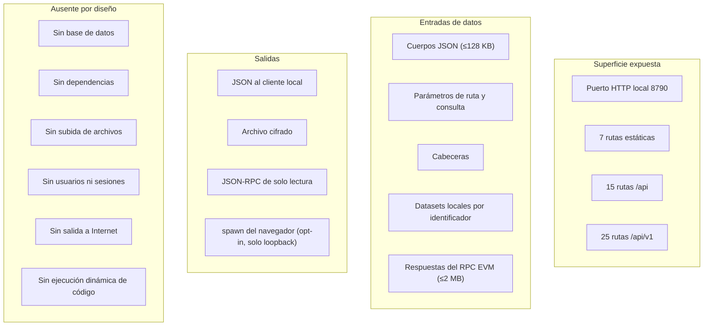

# 11 · Seguridad

> Versión analizada: `0.3.0` · Commit `6d96e71` · Fecha: 2026-08-27
> [← Volver al índice](README.md)

El modelo de amenazas del proyecto está en
[`../THREAT_MODEL.md`](../THREAT_MODEL.md) y la política de reporte en
[`SECURITY.md`](../../SECURITY.md). Este documento es la vista de auditoría:
qué controles existen, cuáles se comprueban de forma ejecutable y **cuáles no
existen**.

> **Nota metodológica.** No se realizaron pruebas destructivas ni ataques contra
> ningún sistema externo. La verificación consistió en leer el código y ejecutar
> los gates que el propio repositorio incluye, incluido
> `scripts/check-security-claims.js`, que arranca la aplicación real y la golpea
> con peticiones hostiles.

---

## Autenticación

**No existe.** No hay usuarios, contraseñas, tokens, sesiones ni claves de API.

**Justificación del proyecto:** es una aplicación de escritorio que corre en la
máquina del operador y escucha en loopback. Quien tiene acceso a esa máquina y a
ese puerto **es** el operador.

**Consecuencia que hay que entender:** el control de acceso es el control de
acceso del sistema operativo. Si la aplicación se expone fuera de loopback sin
un proxy autenticado delante, cualquiera que alcance el puerto puede leer el
inventario completo, registrar proyectos y aprobar hashes de cambio.

**Recomendación:** dejar `HOST=127.0.0.1`. Si hace falta acceso remoto, un proxy
inverso con autenticación real y TLS, nunca la aplicación desnuda.

---

## Autorización, roles y permisos

**No existen.** Todo el que puede hablar con la API puede hacer todo lo que la
API permite.

`x-rootcause-actor` **no es una credencial**: se valida su forma
(`[a-z0-9._@-]{1,80}`) y se usa como etiqueta en la auditoría. Un valor que no
cumpla el patrón no produce error: se sustituye por `local-user`.

**Inferencia:** esto es coherente con el modelo de despliegue, pero significa
que la cadena de auditoría documenta **lo que alguien dijo ser**, no lo que se
verificó que era. Para un uso de equipo con trazabilidad real haría falta
autenticación —y es una de las decisiones que
[15 · Riesgos](15-risks-and-technical-debt.md) recoge como pendiente.

---

## Gestión de sesiones

**No hay sesiones.** No hay cookies, ni `localStorage` con estado de
autenticación, ni tokens. Cada petición es independiente.

---

## Validación y sanitización

### Estrategia: rechazar, no sanear

El sistema **no limpia** entradas problemáticas: las rechaza con un error. Es la
elección correcta para un sistema de evidencia, porque un dato saneado es un
dato distinto del observado, y en un informe forense eso importa.

### Capas, en orden de ejecución

| # | Control | Módulo | Fallo |
|---|---|---|---|
| 1 | Límite de ritmo | `createRateLimiter` | 429 |
| 2 | Cabecera de mutación | `validateMutationRequest` | 403 |
| 3 | `sec-fetch-site` | `validateMutationRequest` | 403 |
| 4 | Content-Type | `readJson` | 415 |
| 5 | Tamaño del cuerpo | `readJson` | 413 |
| 6 | JSON parseable | `readJson` | 400 |
| 7 | **Material secreto** | `assertNoSecretMaterial` | **422** |
| 8 | Tipos y vocabularios | validadores | 400 |
| 9 | Construcción campo a campo | normalizadores | 400 |
| 10 | Reglas de negocio | servicios | 400 / 409 |

### Validaciones destacadas para un auditor

| Superficie | Control | Suficiencia |
|---|---|---|
| Rutas estáticas | Mapa cerrado `STATIC_FILES` | **Path traversal imposible por construcción**: no hay concatenación con datos del usuario |
| Carga de datasets | Patrón restrictivo + comprobación de ruta resuelta | Doble capa; ejercitada por el gate |
| Direcciones EVM | `^0x[0-9a-f]{40}$` y minúsculas | Suficiente |
| Direcciones Bitcoin | Checksum real base58check y bech32/bech32m | Suficiente y verificado con casos negativos |
| Montos | Solo dígitos, hasta 78 | Impide inyección numérica y pérdida de precisión |
| Identificadores en rutas | Patrones acotados por regex | Suficiente |
| Cotas del grafo | `bound()` sobre todo parámetro externo | Impide agotamiento por consulta |
| Salida al DOM | `escapeHtml` en **todo** dato | Suficiente **siempre que se aplique sin excepción** |

### Superficies de inyección evaluadas

| Vector | Estado |
|---|---|
| **SQL** | **No aplica**: no hay base de datos ni consultas |
| **NoSQL** | **No aplica** |
| **Comandos del sistema** | Un único `spawn` en `openBrowserIfRequested`, con comando fijo por plataforma y la URL construida por el propio proceso desde `config.host` y el puerto. **No hay entrada de usuario en el comando.** |
| **Ruta de archivo** | Dos puntos: los estáticos (mapa cerrado) y los datasets (doble validación) |
| **XSS** | Mitigado por `escapeHtml` universal + CSP `script-src 'self'` sin `unsafe-inline` |
| **Prototype pollution** | Mitigado: los normalizadores construyen objetos nuevos campo a campo; no hay merge recursivo de la entrada |
| **ReDoS** | Los patrones son simples y anclados; las entradas están acotadas en longitud. **Requiere validación** para un análisis formal |
| **Deserialización** | Solo `JSON.parse`, sin *revivers* |

---

## Cifrado

| Uso | Algoritmo | Detalle |
|---|---|---|
| Estado en reposo | **AES-256-GCM** | IV de 12 bytes aleatorio por escritura; tag de autenticación |
| Identidad de hallazgo | SHA-256 truncado a 20 hex | No es un uso de seguridad: es una clave estable |
| Cadena de auditoría | SHA-256 sobre JSON canónico | Detección de manipulación |
| Sello de evidencia | SHA-256 del payload | Integridad verificable |
| Validación Bitcoin | Doble SHA-256 (base58check) | Verificación de checksum |
| Identificadores | `crypto.randomUUID()` | CSPRNG del sistema |

**En tránsito: no hay TLS.** El tráfico es HTTP plano sobre loopback, donde el
cifrado no aporta —el tráfico no sale de la máquina—. Exponer la aplicación sin
TLS a una red sí sería un problema, y es otra razón para no hacerlo.

**Valoración de las elecciones criptográficas:** AES-256-GCM con IV aleatorio de
12 bytes por operación y tag de autenticación es la construcción correcta para
cifrado autenticado. La clave se exige de exactamente 32 bytes. No hay
derivación de clave a partir de una contraseña —la clave **es** el secreto—, lo
que evita el error clásico de una KDF mal parametrizada.

**Limitación:** no hay rotación de clave implementada. Cambiarla exigiría
descifrar con la antigua y recifrar con la nueva, y el repositorio no ofrece esa
utilidad. **Requiere validación** con el mantenedor.

---

## Manejo de secretos

### Lo que el sistema **rechaza** aceptar

`assertNoSecretMaterial` bloquea, con 422 y `SECRET_MATERIAL_REJECTED`:

- **Por nombre de campo** (tras normalizar a solo alfanuméricos en minúsculas y
  buscar por inclusión): `privatekey`, `signingkey`, `secret`, `password`,
  `mnemonic`, `seed`, `seedphrase`, `recoveryphrase`, `recoverywords`,
  `keystore`, `walletbackup`, `xprv`, `tprv`, `wif`, `rawsignedtransaction`,
  `rpcpassword`, `authorization`, `authtoken`, `accesstoken`, `refreshtoken`,
  `clientsecret`, `apikey`.
- **Por contenido:** claves extendidas BIP-32, claves WIF, bloques PEM de clave
  privada y URL con credenciales embebidas.

Se aplica en 12 puntos de entrada distintos entre defensa e inteligencia.

### Lo que el sistema redacta

`redactForAudit` se ejecuta **antes** de hashear la entrada de auditoría, así que
la versión redactada es la que se guarda y la que se firma. Trunca a 512
caracteres.

### Lo que el repositorio impide guardar

`scripts/validate-repo.js` falla si encuentra un bloque PEM de clave privada o
una clave extendida en cualquier archivo `.js`, `.json`, `.md`, `.html`, `.css`,
`.svg`, `.yml`, `.webmanifest` o `.example`.

### Hueco conocido

Una frase semilla BIP-39 escrita como texto natural en un campo con nombre
inocuo (por ejemplo `purpose` o `note`) **no coincide con ningún patrón de
contenido**. La defensa efectiva en ese caso es el filtro de nombres de campo, y
la mitigación parcial es el truncado a 512 caracteres en la auditoría.
Registrado en [15 · Riesgos](15-risks-and-technical-debt.md).

---

## Registro y auditoría

### Cadena encadenada

Cada entrada guarda el `hash` de la anterior; su propio hash se calcula sobre la
entrada completa incluido ese `previousHash`. El primer eslabón es `"GENESIS"`.

`GET /api/audit` devuelve la verificación junto con las entradas, y el panel la
muestra. `verifyAuditChain` indica **dónde y por qué** se rompió, si se rompió.

### Qué garantiza y qué no

| Amenaza | ¿Detectada? |
|---|---|
| Modificar una entrada intermedia | **Sí** — invalida esa entrada y todas las posteriores |
| Eliminar una entrada intermedia | **Sí** — rompe el encadenado |
| Reordenar entradas | **Sí** |
| **Truncar el final de la cadena** | **No** — quitar las últimas N deja una cadena válida y más corta |
| **Reconstruir la cadena entera** con acceso al archivo y a la clave | **No** — no hay firma con clave separada ni anclaje externo |

**Valoración honesta:** es un detector de manipulación accidental o poco
sofisticada. No es una prueba criptográfica frente a un adversario con acceso
local privilegiado, que es exactamente lo que
[`../THREAT_MODEL.md`](../THREAT_MODEL.md) declara fuera de alcance.

### Registro de aplicación

Cuatro eventos en formato JSON de una línea: `server_started`,
`startup_failed`, `request_failed`, `watchtower_tick_failed`. Van a la salida
estándar del proceso; **no hay archivo de registro ni rotación**.

**Verificado:** el registro **no incluye** cuerpos de petición ni datos de
usuario. Un error 5xx registra solo el mensaje de la excepción.

---

## Dependencias vulnerables

**Superficie: cero.** No hay dependencias de terceros que puedan tener
vulnerabilidades. Es la reducción de superficie de ataque más radical posible en
la cadena de suministro, y está protegida por un gate.

Lo que **sí** es código de terceros ejecutándose en el proyecto:

| Elemento | Riesgo | Mitigación |
|---|---|---|
| **Node.js** | Vulnerabilidades del runtime | Se exige `>=22.12.0`; el empaquetador descarga el `node.exe` oficial y **verifica su SHA-256** contra el `SHASUMS256.txt` de nodejs.org |
| **GitHub Actions** | Acción comprometida | **Todas pinneadas a commit SHA**, no a etiqueta; Dependabot semanal propone las subidas |
| **Chrome/Edge** para PDF | Solo herramientas | No participa en el producto |
| **Inno Setup** | Solo empaquetado | No participa en el producto |

El pinneo a SHA de las acciones es un detalle que muchos proyectos omiten: una
etiqueta `@v4` puede reapuntarse a otro commit, un SHA no.

---

## Exposición de información

| Superficie | Estado |
|---|---|
| Mensajes de error 5xx | **Genéricos.** El detalle queda en el registro local |
| Mensajes de error 4xx | Descriptivos, sobre lo que envió el cliente. No filtran estado interno |
| Cabecera `server` | Node añade la suya por defecto. **Requiere validación:** no se retira explícitamente |
| `x-request-id` | UUID sin información |
| Trazas de pila | **Nunca** viajan al cliente |
| Configuración | `/api/policies` expone la política; **no** expone claves ni el endpoint RPC |
| Instantánea del nodo | Expone el endpoint configurado en `node.endpoint` — y en el camino de error se limpia la cadena de consulta con `replace(/\?.*$/, "")` |
| `referrer-policy: no-referrer` | Impide filtrar la URL local a un tercero si alguien pega un enlace |

---

## CORS y CSRF

### CORS

**No hay cabeceras CORS.** Ningún origen externo puede leer las respuestas: el
navegador bloquea la lectura por la política del mismo origen. Es la postura
correcta para una aplicación local.

### CSRF

Tres capas:

1. **Cabecera personalizada obligatoria.** `x-rootcause-request: 1` en toda
   mutación. Un `<form>` de otra web no puede añadir cabeceras personalizadas, y
   un `fetch` que lo intente dispara *preflight* CORS, que este servidor no
   responde.
2. **`sec-fetch-site`.** Se rechaza lo que no sea `same-origin` ni `none`.
   Nota: si la cabecera **no viene** —cliente que no es navegador— la
   comprobación se salta, lo cual es coherente porque es un metadato del
   navegador, no una credencial.
3. **CSP `form-action 'self'`.** Impide que un formulario de la propia página se
   envíe a otro origen.

**Valoración:** adecuada para el modelo de despliegue. El escenario real que
mitiga es que el operador visite una web maliciosa mientras la consola está
abierta, y esas tres capas lo cubren.

---

## Carga de archivos

**No existe.** No hay endpoint de subida, no se procesa `multipart/form-data` y
el único formato aceptado es JSON. La evidencia se adjunta como **payload JSON**,
no como archivo.

Es una superficie de ataque entera que sencillamente no está presente.

---

## Protección de datos personales

**Por diseño, el sistema no almacena datos personales.** La protección no es un
control añadido: es la **ausencia de campos** donde guardarlos.

`normalizeWatchedAccount` lleva el comentario explícito: «Deliberadamente NO
admite nombre real, correo, teléfono, ubicación, biometría ni material de
respaldo». Como los normalizadores reconstruyen la entidad campo a campo,
cualquier propiedad extra que se envíe se descarta.

Los campos de texto libre donde un operador **podría** escribir datos personales
están inventariados en [08 · Flujo de datos](08-data-flow.md#datos-personales-o-sensibles-procesados).

---

## Superficie de ataque

**Explicación del diagrama.** La superficie real es pequeña y está enumerada: un
puerto, 47 rutas, cinco entradas de datos y cuatro salidas. El recuadro
«Ausente por diseño» es la parte más importante del análisis: cada elemento que
no está es una clase entera de vulnerabilidades que no puede existir. Sin base
de datos no hay inyección SQL; sin dependencias no hay CVE de terceros; sin
subida de archivos no hay *path traversal* por nombre de archivo ni ejecución de
contenido subido; sin sesiones no hay secuestro de sesión.

---

## Controles implementados · verificación

Los 51 invariantes que `scripts/check-security-claims.js` comprueba **arrancando
la aplicación real**, agrupados:

| Grupo | Qué comprueba |
|---|---|
| Allowlist JSON-RPC | Que no contenga métodos capaces de mutar o firmar, que no haya perdido los que necesita, y que la función real los rechace |
| RPC remoto | Que se deniegue por defecto, con y sin credenciales |
| Frontera wallet estática | Que `src/**` no contenga capacidades prohibidas de firma o conexión |
| Valores por defecto | Que sean conservadores |
| Runtime hostil | Mutación sin cabecera, mutación cross-site, 7 formas de material secreto, evento con transacción firmada, idempotencia de eventos |
| Frontera wallet en runtime | Que el panel no tenga botón de conectar wallet ni de revocar |
| Frontera de inteligencia | Que el puntaje nunca viaje sin explicación, que la API de riesgo rechace material privado, que el análisis previo sea consultivo, que el grafo aplique sus cotas, que el cargador de datasets rechace el *path traversal*, que no haya listas remotas de reputación |
| Estado | Que arranque con inventario y que la cadena de auditoría esté íntegra |

**Resultado del 27 de agosto de 2026:** `Invariantes de seguridad verificados:
51 comprobaciones.`

Un detalle de ingeniería que merece mención: las cadenas prohibidas en el gate se
construyen **por concatenación** para que el propio archivo del gate —que
contiene esos nombres como documentación— no se denuncie a sí mismo.

---

## Controles ausentes o no comprobados

| Control | Estado | Impacto | Recomendación |
|---|---|---|---|
| Autenticación y autorización | **Ausente por diseño** | Alto si se expone | Documentar el requisito de proxy autenticado |
| TLS | **Ausente** | Nulo en loopback | — |
| Rotación de clave de datos | **Ausente** | Medio a largo plazo | Añadir utilidad de recifrado |
| Respaldo del estado | **No documentado** | Alto | Documentar el procedimiento |
| Bloqueo de archivo entre procesos | **Ausente** | Medio | Bloqueo o comprobación de instancia única |
| Purga del mapa del limitador | **Ausente** | Bajo en loopback | Purga por antigüedad |
| Aviso al exponer fuera de loopback | **Ausente** | Alto | Aviso destacado al arrancar |
| Aviso al usar RPC remoto | **Ausente** | Medio | Aviso al arrancar |
| Firma del artefacto de Windows | **Requiere validación** | Medio | Firma de código si hay certificado |
| Análisis ReDoS formal | **No realizado** | Bajo | Revisión si crecen los patrones |
| `fsync` explícito al guardar | **Ausente** | Bajo | Evaluar si la durabilidad lo exige |
| Cabecera `server` retirada | **No verificado** | Muy bajo | Retirarla si se expone |
| Detección de colector silencioso | **Ausente** | **Alto** | Un panel en verde no distingue «todo bien» de «nadie mira» |

El detalle de cada uno, con severidad, probabilidad y evidencia, está en
[15 · Riesgos y deuda técnica](15-risks-and-technical-debt.md).

---

## La postura de seguridad como característica del producto

Merece un párrafo aparte, porque es lo que distingue a este repositorio: **las
promesas de seguridad son ejecutables**. Un README puede envejecer mal; un gate
que arranca la aplicación y comprueba que rechaza una clave privada, no.

Concretamente:

- «No acepta material secreto» → 7 invariantes que lo intentan de 7 formas.
- «El RPC es de solo lectura» → allowlist + comprobación de que no perdió
  métodos + `grep` independiente en CI.
- «Cero dependencias» → gate sobre manifiestos, lockfile, `node_modules`,
  imports, panel y CSP.
- «El puntaje nunca va solo» → comprobación en caliente sobre la respuesta real.
- «No es una wallet» → comprobación estática sobre `src/**` y comprobación de que
  el panel no tiene los botones.

Para un auditor, esto cambia el trabajo: en lugar de verificar afirmaciones
manualmente, se verifica que **los gates comprueban lo que dicen comprobar**, y
luego se ejecutan.

---

## Documentos relacionados

- [15 · Riesgos y deuda técnica](15-risks-and-technical-debt.md)
- [10 · Configuración](10-configuration.md)
- [`../THREAT_MODEL.md`](../THREAT_MODEL.md)
- [`SECURITY.md`](../../SECURITY.md) — frontera de confianza y reporte de vulnerabilidades
- [`../SECURITY-CHECKLIST.md`](../SECURITY-CHECKLIST.md)
- [`../WALLET-SECURITY-BOUNDARIES.md`](../WALLET-SECURITY-BOUNDARIES.md)
<!-- navegacion -->
---

**[← 10 · Configuración](10-configuration.md)** · **[Índice](README.md)** · **[12 · Pruebas y calidad →](12-testing-and-quality.md)**
