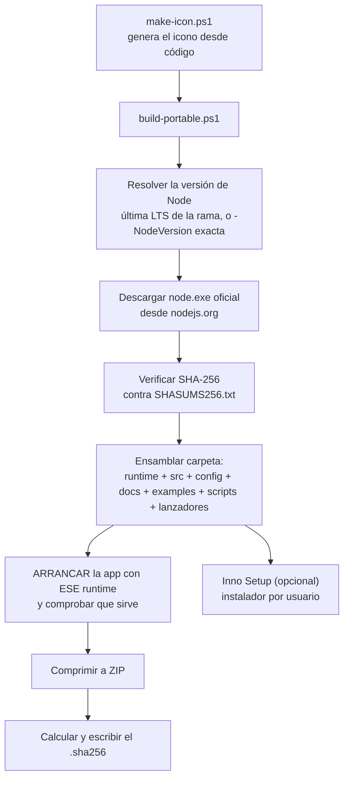
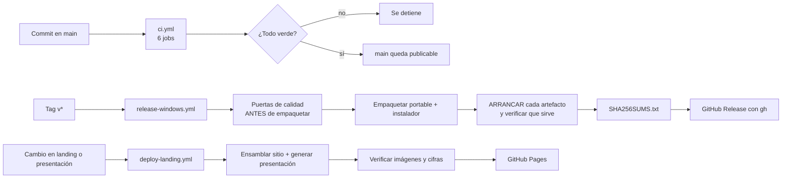

# 13 · Despliegue y operación

> Versión analizada: `0.3.0` · Commit `6d96e71` · Fecha: 2026-08-27
> [← Volver al índice](README.md)

La guía de la edición de escritorio está en
[`../WINDOWS-APP.md`](../WINDOWS-APP.md), la lista de publicación en
[`../RELEASE_CHECKLIST.md`](../RELEASE_CHECKLIST.md) y la respuesta a incidentes
en [`../RUNBOOK.md`](../RUNBOOK.md).

---

## Entornos existentes

| Entorno | Cómo se despliega | Estado | Persistencia |
|---|---|---|---|
| **Escritorio Windows (portable)** | ZIP autocontenido con `node.exe` dentro | **Es el destino principal** | Archivo cifrado |
| **Escritorio Windows (instalador)** | Inno Setup, instalación por usuario | Implementado | Archivo cifrado |
| **Desde el código fuente** | `node src/server.js` | Cualquier sistema con Node ≥ 22.12 | Configurable |
| **Contenedor** | `docker compose up --build` | Implementado, en modo demostración | **Ninguna**: `read_only` |
| **Servidor multiusuario** | — | **No existe y no está previsto** | — |

**Hecho verificado** — no hay Kubernetes, ni Terraform, ni plantillas de nube, ni
scripts de aprovisionamiento. Es coherente con
[`../ADR-0001-plataforma-y-lenguaje.md`](../ADR-0001-plataforma-y-lenguaje.md),
que razona por qué el producto es de escritorio y no SaaS.

---

## Proceso de construcción

**No hay compilación.** El código se ejecuta tal cual: ESM nativo, sin
transpilar, sin empaquetar, sin minificar. Consecuencia práctica: **lo que se
audita es exactamente lo que se ejecuta**, tanto en el repositorio como dentro
del ZIP portable.

Lo único que se «construye» es el empaquetado de Windows y la documentación
generada.

---

## Empaquetado de Windows

**Explicación del diagrama.** Los dos pasos que distinguen este empaquetado de
uno corriente son E y G. En **E** se verifica la huella del `node.exe` descargado
contra el `SHASUMS256.txt` que publica nodejs.org: sin esa comprobación, el
runtime que se distribuye a los usuarios dependería de que la descarga no fuera
manipulada. En **G** se arranca la aplicación **con el runtime empaquetado**
antes de comprimir nada: un ZIP del tamaño correcto no prueba que la aplicación
funcione.

Para una construcción reproducible hay que fijar la versión exacta:

~~~bash
powershell -File packaging/windows/build-portable.ps1 -NodeVersion 22.21.1
~~~

Sin `-NodeVersion`, el script resuelve la última LTS de la rama indicada, con lo
que dos construcciones en fechas distintas pueden incluir runtimes distintos.

### Salida

| Artefacto | Contenido |
|---|---|
| `build/portable/RootCause-Blockchain-Security/` | Carpeta ensamblada |
| `RootCause-Blockchain-Security-<versión>-win-x64-portable.zip` | Distribuible |
| `<ZIP>.sha256` | Huella del ZIP |
| `BUILD-INFO.json` (dentro de la carpeta) | Versión de la aplicación y del runtime |

`build/` está en `.gitignore`: son artefactos.

---

## Contenedor

~~~dockerfile
FROM node:22.14.0-alpine
WORKDIR /app
COPY . .
ENV HOST=0.0.0.0 PORT=8790 DEMO_MODE=true
EXPOSE 8790
USER node
CMD ["node", "src/server.js"]
~~~

Posturas de seguridad aplicadas en `compose.yaml`:

| Medida | Efecto |
|---|---|
| `ports: "127.0.0.1:8790:8790"` | El puerto **no** se publica en la red, solo en loopback del anfitrión |
| `read_only: true` | Sistema de archivos del contenedor de solo lectura |
| `tmpfs: /tmp` | Escritura temporal en memoria |
| `security_opt: no-new-privileges:true` | Impide escalada por binarios setuid |
| `cap_drop: ALL` | Sin capacidades de Linux |
| `USER node` | No corre como root |

**Limitación importante, verificada:** con `read_only: true` y `DEMO_MODE=true`,
el contenedor **no puede persistir estado**. Usarlo con datos reales exigiría
montar un volumen para `DATA_DIR` y pasar `ROOTCAUSE_DATA_KEY` por un mecanismo
de secretos. **El repositorio no documenta ese despliegue.** Requiere validación
con el mantenedor.

Nota menor: la imagen fija `node:22.14.0-alpine` mientras el empaquetado de
Windows resuelve la última LTS. **Inferencia:** son criterios distintos para el
mismo runtime, y conviene saberlo al comparar comportamientos.

---

## CI/CD

### Diagrama del flujo de publicación

**Explicación del diagrama.** El orden en `release-windows.yml` es la parte
importante: **las puertas de calidad corren antes de empaquetar**, de modo que un
tag no puede publicar un artefacto que no superó los invariantes de seguridad. Y
cada artefacto se **arranca** antes de subirse, por la razón que el propio
workflow enuncia: «un binario que compila y pesa lo esperado puede instalarse
vacío; eso solo se descubre ejecutándolo».

La release la crea `gh` con el token del propio workflow: **sin acciones de
terceros** en el paso que publica.

`workflow_dispatch` permite ensayar el empaquetado completo sin crear un tag:
construye y verifica, pero no publica.

### Reproducir CI en local

~~~bash
pnpm check
~~~

Equivale a los jobs `calidad`, `solo-local`, `invariantes`, `reglas` y
`documentacion`. El job `app-windows` requiere Windows y PowerShell.

---

## Publicar una versión

Pasos verificados en `../RELEASE_CHECKLIST.md` y en el workflow:

1. Subir `version` en `package.json`.
2. Actualizar `CHANGELOG.md`.
3. **Comprobar la versión escrita a mano en `/api/health`** —está literal en
   `src/api/router.js`, así que no se actualiza sola. Ver
   [15 · Riesgos](15-risks-and-technical-debt.md).
4. Ejecutar `pnpm check` en local.
5. Crear y empujar el tag `v<versión>`.
6. El workflow valida, empaqueta, arranca, calcula checksums y publica.
7. Verificar la descarga contra `SHA256SUMS.txt`.

---

## Migraciones

**No hay scripts de migración, y es viable porque el modelo solo ha añadido
campos.** La migración es perezosa y ocurre al cargar:

| Punto | Qué migra |
|---|---|
| `DefenseService.initialize` | Crea los arrays que falten (`watchedAccounts`, `walletEvents`, `approvals`, `incidents`, `audit`) sin tocar el resto |
| `IntelligenceService.ensureState` | Crea el bloque `intelligence` completo con sus sub-estructuras |
| `decryptJson` | Rechaza sobres de versión o algoritmo distintos |

**Consecuencia:** un estado escrito por 0.1.0 se abre en 0.3.0 sin conversión.
**Y la consecuencia inversa:** no hay migración hacia atrás. Un estado escrito por
0.3.0 y abierto por 0.1.0 tendría campos que esa versión ignora —**requiere
validación**, no está probado.

`schemaVersion` está presente (`2` en el estado raíz, `1` en el de inteligencia)
pero **no se comprueba en ninguna parte**. Es un campo preparado para un uso que
todavía no existe. Registrado en [15 · Riesgos](15-risks-and-technical-debt.md).

---

## Logs

| Aspecto | Estado |
|---|---|
| Formato | JSON de una línea |
| Destino | `stdout` para `server_started`; `stderr` para el resto |
| Eventos | `server_started`, `startup_failed`, `request_failed`, `watchtower_tick_failed` |
| Nivel configurable | **No existe** |
| Archivo de registro | **No existe** |
| Rotación | **No aplica** |
| Datos sensibles | **No se registran** cuerpos ni datos de usuario |

En la edición de escritorio, la salida va a la ventana de consola del lanzador.
Cerrar esa ventana cierra la aplicación.

**Recomendación operativa:** si hace falta conservar el registro, redirigirlo al
arrancar. Es la solución de menor fricción y no requiere tocar el producto.

---

## Métricas

| Métrica | Dónde |
|---|---|
| Riesgo consolidado y conteo por severidad | `GET /api/summary` |
| Totales de inventario | `GET /api/summary` |
| Postura de wallets (11 contadores) | `summary.walletPosture` |
| Integridad de la auditoría | `summary.audit` |
| Estado del observador | `summary.node` |
| Transacciones, bloques, reorgs, indicadores, alertas, casos, evidencia | `GET /api/v1/intelligence/summary` |
| Tamaño del grafo | `summary.graph` |
| **Métricas por conector**: peticiones, fallos, reintentos, último error, última latencia, último éxito | `GET /api/v1/intelligence/connectors` |

**No hay endpoint de métricas para Prometheus ni formato de exportación.** Las
métricas son de negocio, no de proceso: no hay uso de CPU, memoria ni latencia
de petición.

---

## Monitoreo y alertas

| Capacidad | Estado |
|---|---|
| El sistema se vigila a sí mismo | **Sí**, mediante `BLK-NODE-001/002/003` |
| Vigilancia periódica | **Sí**, opcional: watchtower |
| Alertas en el panel | **Sí** |
| **Notificaciones externas** (correo, chat, webhook) | **No existen** |
| Comprobación de salud | `GET /api/health` |
| Vigilancia del proceso | **No existe.** Nadie reinicia la aplicación si muere |

**Hueco operativo importante:** el sistema detecta que su observador RPC dejó de
ver, pero **no detecta que un colector dejó de enviar eventos**. Un panel en
verde puede significar «todo bien» o «nadie está mirando», y no hay forma de
distinguirlo desde dentro. Registrado en
[15 · Riesgos](15-risks-and-technical-debt.md) con prioridad alta.

---

## Respaldos y recuperación

**No documentado en el repositorio.** No hay script de respaldo ni procedimiento
escrito. **Requiere validación** con el mantenedor.

Procedimiento mínimo, como **inferencia** de cómo funciona el almacén:

### Respaldo

1. Detener la aplicación —o aceptar que la copia puede quedar entre dos
   escrituras; el `rename` atómico garantiza que **el archivo nunca está a
   medias**, así que en el peor caso se copia la versión anterior.
2. Copiar `data/state.enc.json`.
3. **La clave se respalda por separado**, en un gestor de secretos. Sin ella la
   copia es inútil.

### Recuperación

1. Detener la aplicación.
2. Restaurar el archivo.
3. Comprobar que `ROOTCAUSE_DATA_KEY` es la que corresponde.
4. Arrancar. Si la clave no es la correcta, el arranque **falla** al no validar
   el tag GCM —que es lo correcto, y por qué el error se propaga en lugar de
   caer a un estado vacío.
5. Verificar con `GET /api/audit` que la cadena está íntegra.

### Rotación de clave

**No implementada.** Exigiría descifrar con la clave antigua y recifrar con la
nueva; el repositorio no ofrece esa utilidad.

---

## Rollback

| Escenario | Procedimiento |
|---|---|
| Una versión nueva falla | Descargar el ZIP de la versión anterior desde las releases y ejecutarlo. **El estado es compatible hacia adelante**, pero hacia atrás **requiere validación** |
| Un cambio en la política produce ruido | Restaurar `config/policies.json` y **reiniciar** —los catálogos se leen solo al arrancar |
| Un despliegue con datos corruptos | Restaurar el respaldo del archivo cifrado |
| Un commit rompe `main` | `git revert`; CI vuelve a validar |

---

## Procedimiento básico de mantenimiento

### Semanal

- Revisar el PR de Dependabot con las subidas de GitHub Actions.
- Comprobar que `main` está en verde.

### Mensual

- `pnpm check` en local sobre la última versión de Node LTS.
- Revisar los incidentes resueltos automáticamente: si muchos se resuelven y
  reaparecen, hay un umbral mal calibrado.
- Revisar la tasa de falsos positivos declarados en las alertas: el campo
  `falsePositiveReason` existe precisamente para poder medir la calidad del
  motor.

### Al publicar una versión

Seguir [`../RELEASE_CHECKLIST.md`](../RELEASE_CHECKLIST.md).

### Al cambiar una política

1. Editar el JSON de `config/`.
2. **Reiniciar el proceso** —no hay recarga en caliente.
3. Ejecutar `POST /api/scan` y comparar el resultado.
4. Si se tocó una regla o un indicador, `node scripts/check-rule-coverage.js`.

### Al añadir una regla o un indicador

Seguir [`../CONTRIBUTING.md`](../../CONTRIBUTING.md) y
[18 · Guía para un nuevo desarrollador](18-new-developer-guide.md#añadir-una-regla-blk).
El gate de cobertura obliga a tocar motor, catálogo, política y README a la vez.

---

## Generar la documentación del sistema

~~~bash
node scripts/build-system-docs.js
~~~

Produce, en `docs/system-documentation/pdf/`, un PDF por documento y un
compendio con todos. Requiere un Chrome o un Edge instalado; se puede indicar la
ruta con `ROOTCAUSE_CHROME`.

El mecanismo es el mismo que usa `scripts/render-presentation-pdf.js`: se lanza
el navegador en modo headless con un puerto de depuración efímero y se le habla
por el protocolo DevTools con el WebSocket que trae Node. **Cero dependencias
también en las herramientas.**

---

## Documentos relacionados

- [02 · Instalación y ejecución](02-installation-and-execution.md)
- [10 · Configuración](10-configuration.md)
- [14 · Solución de problemas](14-troubleshooting.md)
- [`../WINDOWS-APP.md`](../WINDOWS-APP.md)
- [`../RELEASE_CHECKLIST.md`](../RELEASE_CHECKLIST.md)
- [`../RUNBOOK.md`](../RUNBOOK.md)
- [`../CI_GITHUB.md`](../CI_GITHUB.md)
<!-- navegacion -->
---

**[← 12 · Pruebas y calidad](12-testing-and-quality.md)** · **[Índice](README.md)** · **[14 · Solución de problemas →](14-troubleshooting.md)**
